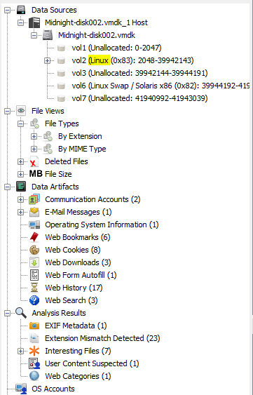
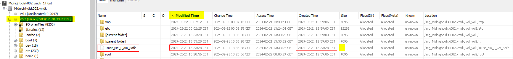
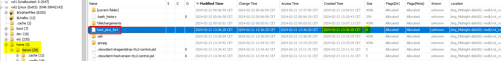
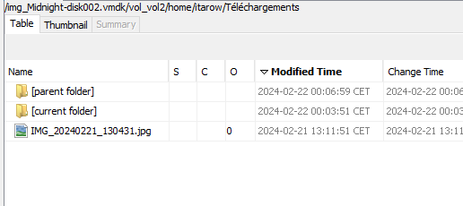
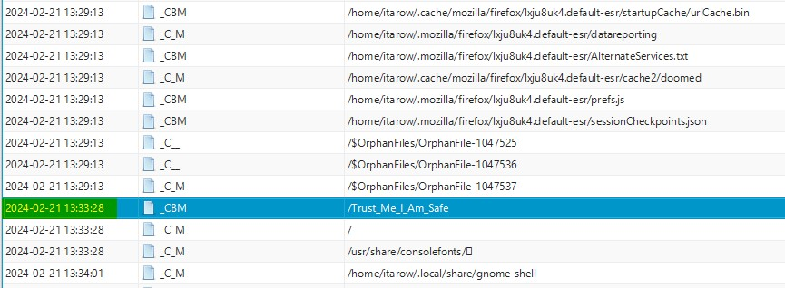

# Midnight Flag 2024 - Croissanted
---

## Category

> Forensics

## Description

> FR : Une backdoor semble avoir été déposée sur une machine virtuelle. Des fichiers ont été ajoutés dans le filesystem. Bien que l'utilisateur change régulièrement son mot de passe, les intrusions continuent. Identifiez pourquoi. Une copie de la VM vous a été fournie.
>
> EN: A backdoor seems to have been placed on a virtual machine. Files have been added to the filesystem. Although the user regularly changes their password, the intrusions continue. Identify why. A copy of the VM has been provided to you.
> 
> Flag format : MCTF{/full/path/backdoor1:/full/path/backdoor2}

## Files

Lien de téléchargement / Download link :
Google Drive : https://drive.google.com/file/d/1SPxsP1BgIZTkuVe_qIzxgVsNWIgss_vn/view?usp=sharing
Mega : https://mega.nz/file/tFoljBKa#nQzbbbOS9VfCc3dJq3idTa7-dgLAHVd3jmr0c4C6KJA

- Author: **klemou**
---

## Write up

According to the description, persistence has been applied on his system. We'll need to find evidence of the compromise from the attacker, then what files did he drop to maintain persistence.

We could look inside the crontab, the files loaded at boot, or SSH keys for example.

I used [Autopsy](https://www.autopsy.com/) for windows to statically analyze the disk.
It can take a while, but we end up with something like this:

It allows us to browse the disk by:
- arbores
- file type
- delete files
- data artifacts
  - emails
  - web
    - cookies
    - download
    - history

Here is how I found the evidence.

### Suspicious files

I begin by looking at the files' tree from the main partition. Folders like ``/home``, `/etc` can be useful to hide something.

To speed up research, I sorted the results by **modified time**, to see last events first.

First suspicious files is ``/Trust_Me_I_Am_Safe``, which is at the root of the tree. We have its creation time, **2024-02-21 13:33:28 CET**, and size is empty.

We begin to identify the timeframe.

Another suspicious empty file is located at ``/home/itarow/hack_plus_fort``, created 3 minutes after the previous one. That's a great beginning.

### Web downloads

I talked about web downloads before, let's look at them:

That is really explicit. He has **downloaded backdoors from a remote ip** in its network. He saved both ``.zip`` in the download folder, which appears to be store only the file downloaded.

We can find the reason by looking at the **root's bash history**:

So he downloaded them at **13:25:42** with Firefox, them removed them using the root account at **13:28:56**.

We have identified the timeframe: between **2024-02-21 13:25:42 CET** and **2024-02-21 13:36:28 CET**

### Timeline

Autopsy allows us to look at the timeline of all events analyzed. Because we could not find an exact correlation between the suspicios events, and the backdoors, and that he deleted the files, it is hard to look at them directly.

To investigate, we'll look at **the events that occurred between our identified timeframe**. We'll probably see it if something is suspect.

Here is a recap of the events:


%%{init: { 'theme': 'default' } }%%
gitGraph:
options
{
    "nodeSpacing": 300,
    "nodeRadius": 50
}
end
    commit id: "Downloads" tag: "13:25:42"
    commit id: "HACK ??" type: HIGHLIGHT tag: "13:2?:??"
    commit id: "Removed" type: REVERSE tag: "13:28:56"
    commit id: "HACK ???" type: HIGHLIGHT tag: "13:??:??"
    commit id: "Trus_Me_I_Am_Safe" tag: "13:33:28"
    commit id: "hack_plus_fort" tag: "13:36:28"


To do so, we'll begin or timeline by the downloaded artifacts, and we'll search for event of **Web downloads** and **Modification, Creation and Deletion** but no ~~Access~~ to reduce the number of events.

Here is our first event:

And there is our last one:

We need to search between them, something suspicious that can achieve persistence.

And here it is:

<<<<<<< HEAD
Just after the download of the ``zip``, two `.so` files have been created in the folder `/usr/lib/x86_64-linux-gnu/security/`, which contains libraries used by the system.
=======
Jst after the download of the ``zip``, two `.so` files have been created in the folder `/usr/lib/x86_64-linux-gnu/security/`, which contains libraries used by the system.
>>>>>>> c93141e (added Midnight flag)

It is **in fact** a really **efficient way to achieve persistence**, because:
- This is not a folder sed by the ser, so they won't ever be found without searching for it
- These are used by the system and lots of programs, at boot and on the run
- More precisely, it looks lie there could be sed by PAM and security systems, with high permissions and really often.

Our two files are:
- ``/usr/lib/x86_64-linux-gnu/security/pam_chevalo.so``
- ``/usr/lib/x86_64-linux-gnu/security/pam_seigneur.so``

The final events are

%%{init: { 'theme': 'default' } }%%
gitGraph
    commit id: "Downloads" tag: "13:25:42"
    commit id: "pam_chevalo.so" type: HIGHLIGHT tag: "13:26:10"
    commit id: "pam_seigneur.so" type: HIGHLIGHT tag: "13:26:13"
    commit id: "Removed" type: REVERSE tag: "13:28:56"
    commit id: "Trus_Me_I_Am_Safe" tag: "13:33:28"
    commit id: "hack_plus_fort" tag: "13:36:28"



:triangular_flag_on_post: `MCTF{/usr/lib/x86_64-linux-gnu/security/pam_seigneur.so:/usr/lib/x86_64-linux-gnu/security/pam_chevalo.so}`

