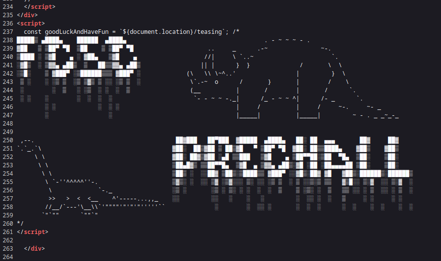
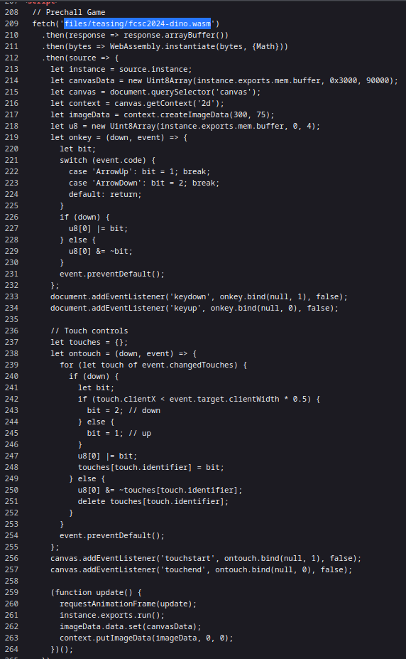
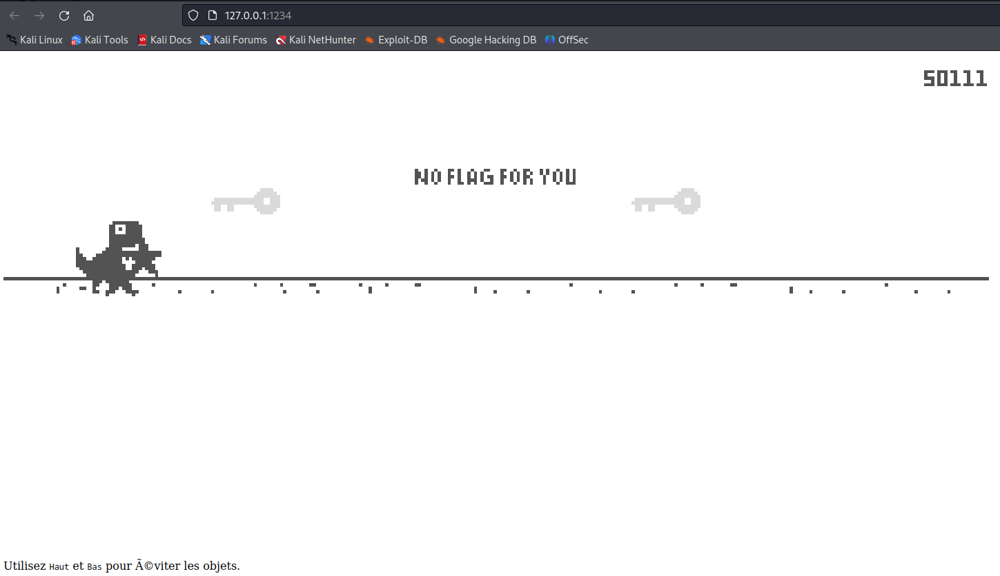
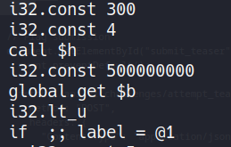
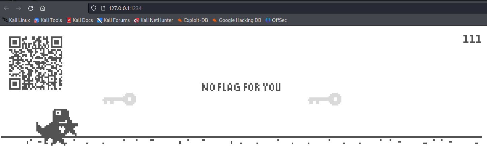

## Category

> Intro

## Description

> Pour vous faire patienter jusqu'au 5 avril 2024 à 14h pour le lancement du FCSC 2024, nous vous proposons cette année encore une épreuve de teasing ! Le point de départ est le jeu donné ci-dessous et vous permettra d'aboutir à un flag au format FCSC{xxx}. La résolution de ce challenge apportera 1 point symbolique pour le FCSC 2024, et sera matérialisée sur le site par un 🔥 à côté des noms d'utilisateur. 

## Files

[dino.wasm](fcsc2024-dino.wasm)

## Difficulty

**INTRO** - 1 point

- Author: **FCSC**
---


## Write up

### Finding the dino

As always, FCSC lets us find and resolve what's called a "prechall", few weeks before the real CTF starts.

Our entry point is their website, a CTFd platform. It is known to be very editable. Something can easily be hidden in the source code.

Just press Ctrl+U on the main page, and you found the dino:



The entrypoint is located here : `/teasing`

### Make the dino run

We found the entrypoint, which is the Chrome Dino game, that can lead us to a flag. Great.

Let's just play a little !


It is a game with a score, so we probably have to hit a certain high score to obtain the flag. This kind of game is really famous in challenges, because of its simplicity of gameplay but which can be challenging to write a program to make a very high score.

Because yes, the goal score might probably be very, very, very high, and impossible to reach in the common way.

Let's just read the source code again. Ctrl+U



The game is loaded with Js, from a wasm file.


WASM stand for **W**eb**As**e**m**bly, which is a binary format that can be loaded in browsers through JavaScript, to run applications with way better performances.


We can then download the file at `/files/teasing/fcsc2024-dino.wasm` and start reversing.

Looking on Google for tools to reverse WASM, we rapidly find the [WebAssembly Binary Toolkit](https://github.com/WebAssembly/wabt). It possesses a bunch of binaries to help in development and manipulation of WebAssembly files.

Only two of them will be useful for us :
- [wasm2wat](https://webassembly.github.io/wabt/demo/wasm2wat/) : convert wasm binary into wasm text format
- [wat2wasm](https://webassembly.github.io/wabt/demo/wat2wasm/) : convert wasm text format to wasm binary

If we try converting our file to text format, it looks like this : 


Nothing really helpful to understand the program. Nothing seems to be a recoverable data hidden. Only a big set of data at the end, but that we could not read.


If the data is not intented to be hidden in plain sight, maybe we need to finish the game to make something appear. Reaching a high score might probably make something spawn to the screen.


We can convert binary to text, and text to binary. It means that we can edit the data.

My first idea at this point, was to find a way to make my score higher, or to set the limit lower.


I found those globlas value set to 0 at the end of the generated wat file. Let's change their value, rebuild the game with `wat2wasm`, and run the program locally.


To play the game locally, just copy the source code of the related `<canvas>` and `<script>` on the `/teasing` page, and past them into a `index.html` file.

```html
<canvas  style="object-fit: contain; image-rendering: pixelated; image-rendering: crisp-edges; width:75%"></canvas>
<p class="text-muted">
  Utilisez <kbd>Haut</kbd> et <kbd>Bas</kbd> pour éviter les objets.
</p>

<script>
  // Prechall Game
  fetch('dino.wasm')
    .then(response => response.arrayBuffer())
    .then(bytes => WebAssembly.instantiate(bytes, {Math}))

...

```

We can run the command `python3 -m http.server <PORT>` to run a web server, and load the web page : 



I understood that on the globals variables : 

- `$a` : idk lol
- `$b` : first instanciation of the __printed__ score, does not change real score
- `$c` : our score, but cannot be setup to a high value because it loses the game instantly.

However, if we try to take a look a bit upper into the programm, we manage to find a suspect value :



Oter big numbers exists in the program, but they look random, like memory adress value. This one is really rounded and probably human-chosen.

What if we lower it to 1, for example ?


Change 500000000 to 1




We have found our next part :wink:


`https://france-cybersecurity-challenge.fr/bded79a9edb3e51a1d752c5ea6dfae1a`


### ...No dino ?

Here is the script of the second step :

```python
from hashlib import sha256

CHARSET = "ABCDEFGHIJKLMNOPQRSTUVWXYZabcdefghijklmnopqrstuvwxyz!?€$*"   # 57
L1 = "$ABFIZht!HPUYhirKOXdhjxy?DGJSWehCENahklo*cghmpu€MQRVfhvzLTbhnqsw" # 64
L2 = "!FOWamwzFRSTUdlp*EFVXbei?FMNPgjsCDFHcnvxFJQYkqy€FGKLforu" # 56
L3 = "!FOWamwz$RcejkrwDIKNVYpwGHMXltw€*APSovwy?BCQdiuwEJUZfgwx" # 56

def check(A, B):
    res = True
    for a in range(7):
        for b in range(7):
            S = set(A[a])
            for x in range(7):
                y = (a * x + b) % 7
                S = S.intersection(set(B[y][x]))
            res &= (len(S) == 1)
    for x in range(7):
        S = set(A[7])
        for y in range(7):
            S = S.intersection(set(B[y][x]))
        res &= (len(S) == 1)
    return res

s = input(">>> ")

assert len(s) == 8 * (8 * 7 + 1)
assert all(x in CHARSET for x in s)

s1, s2 = s[:8 * 8], s[8 * 8:]
A = [ s1[j:j + 8] for j in range(0, 8 * 8, 8) ] # 64
B = [ [s2[i:i + 8 * 7][j:j + 8] for j in range(0, 8 * 7, 8) ] for i in range(0, len(s2), 8 * 7)]

assert L1 == "".join(A)
assert L2 == "".join([ B[0][i] for i in range(7) ])
assert L3 == "".join([ B[i][0] for i in range(7) ])
assert all([ sorted(B[i][j]) == list(B[i][j]) for i in range(7) for j in range(7) ])
assert check(A, B)

h = sha256(s.encode()).hexdigest()
print(f"Congrats! You can now go here: https://france-cybersecurity-challenge.fr/{h}")
```

Summerize :

- we give an input
- it passes through multiple condition
- if they are all good : this was the good input, print result

Concering the content of the script :

- The input must only be composed of char from the 57-long charset
- It must be `8 * (8 * 7 + 1) = 456` chars long
- It must begin by the L1 string
- It must be followed by the string L2

Then, it begins to be a little more complex. We need to see the remaingin chars of the input string as an array of 7 array, of 6 string of 8 chars long. The first array being populated with the previous L2.


Table of 7x7 groups of 8 chars


For the example, I populated the rest of the input with `#`. You'll need to comment the `assert all(x in CHARSET for x in s)`, or apply your modification after. It must look like this :  
  
```python
['!FOWamwz', 'FRSTUdlp', '*EFVXbei', '?FMNPgjs', 'CDFHcnvx', 'FJQYkqy€', 'FGKLforu']
['########', '########', '########', '########', '########', '########', '########']
['########', '########', '########', '########', '########', '########', '########']
['########', '########', '########', '########', '########', '########', '########']
['########', '########', '########', '########', '########', '########', '########']
['########', '########', '########', '########', '########', '########', '########']
['########', '########', '########', '########', '########', '########', '########']  
```

Now that we see this format, the next condition :

- Populate the first string of all columns with L3

Indeed, it must look like this : 

```python  
['!FOWamwz', 'FRSTUdlp', '*EFVXbei', '?FMNPgjs', 'CDFHcnvx', 'FJQYkqy€', 'FGKLforu']
['$Rcejkrw', '########', '########', '########', '########', '########', '########']
['DIKNVYpw', '########', '########', '########', '########', '########', '########']
['GHMXltw€', '########', '########', '########', '########', '########', '########']
['*APSovwy', '########', '########', '########', '########', '########', '########']
['?BCQdiuw', '########', '########', '########', '########', '########', '########']
['EJUZfgwx', '########', '########', '########', '########', '########', '########']
```



Just forget about the condition that check if it is sorted for the moment.


The last, and not least step, is tu understand th purpose of the function `check(A,B)`.

To be clear, what are A and B :

- A : the first 64 chars splitted in chunks of 8 (8 groups of 8 chars)
- B : the double array of 7x7 chunks of 8 chars (7 lines of 7 columns of 8 chars)  

I personnally used a debugger to better understand what was happenning in the function.

Briefly : **it goes through all the double-array B, and check if each group has one AND ONLY ONE char in common with every group of A**

Do you know the game [dobble](https://www.dobblegame.com/) ?

It is a card game that match exactly our needs : 

> Requirement 1: every card has exactly one symbol in common with every other card.
> 
> Requirement 2: each card has the same number of symbols.
> 
> Requirement 3: no symbol appears more than once on a given card.

It is not required to understand the math behind the game, but it really helps understand the purpose of this whole script, and why the charset is of 57 for example ;)

A represent our first set of 8 cards, B is already part-populated.

The first line verification will be successful, because it already has been greatly fullfilled.

The alrgorithm is all alredy written, because each line of B has a part of the charset we need.

**THE SOLUTION IS** :

- Let the algorithm go as it follows. You will have the unique char at each rotation, for each line.
- Keep this unique char.
- Replace one TEMPLATE_CHAR of the next step by this one unique char.
- The verification of the next step will work, because you just fullfilled it as the `check()` function wanted it to be.

The script looks as it follow :

```python  
CHARSET = "ABCDEFGHIJKLMNOPQRSTUVWXYZabcdefghijklmnopqrstuvwxyz!?€$*"
L1 = "$ABFIZht!HPUYhirKOXdhjxy?DGJSWehCENahklo*cghmpu€MQRVfhvzLTbhnqsw"
L2 = "!FOWamwzFRSTUdlp*EFVXbei?FMNPgjsCDFHcnvxFJQYkqy€FGKLforu"
L3 = "!FOWamwz$RcejkrwDIKNVYpwGHMXltw€*APSovwy?BCQdiuwEJUZfgwx"

TEMPLATE_CHAR = "#" # Must not be in CHARSET
SIZE = 8 * (8 * 7 + 1)

def check_solve(A, B):
    res = True
    for a in range(7):
        for b in range(7):
            S = set(A[a])
            for x in range(7):
                y = (a * x + b) % 7
                S = S.intersection(set(B[y][x]))
                B[(a * (x+1) + b) % 7][(x+1)%7] = B[(a * (x+1) + b) % 7][(x+1)%7].replace(TEMPLATE_CHAR, list(S)[0], 1) # Replace 1 TEMPLATE_CHAR by the unique char found at the next iteration 
            res &= (len(S) == 1)
    for x in range(7):
        S = set(A[7])
        for y in range(7):
            S = S.intersection(set(B[y][x]))
            B[(y+1)%7][x] = B[(y+1)%7][x].replace(TEMPLATE_CHAR, list(S)[0], 1) # Replace 1 TEMPLATE_CHAR by the unique char found at the next iteration
        res &= (len(S) == 1)
    return res

s = L1 + L2 #input(">>> ")
s += TEMPLATE_CHAR * (SIZE - len(s))

s1, s2 = s[:8 * 8], s[8 * 8:]
A = [ s1[j:j + 8] for j in range(0, 8 * 8, 8) ]
B = [ [s2[i:i + 8 * 7][j:j + 8] for j in range(0, 8 * 7, 8) ] for i in range(0, len(s2), 8 * 7)]

for i in range(len(B)):
    B[i][0] = L3[i*8:(i+1)*8]

check_solve(A, B)

for y in range(len(B)):
    for x in range(len(B[y])):
        B[y][x] = ''.join(sorted(B[y][x]))
```

This part of the script construct the double-array B as intented by the check function. B must look like this :

```python
['!FOWamwz', 'FRSTUdlp', '*EFVXbei', '?FMNPgjs', 'CDFHcnvx', 'FJQYkqy€', 'FGKLforu']
['$Rcejkrw', '!$?TVox€', '$DMUabuy', '$JKilmsv', '$EGOPQnp', '$*HNWdfq', '$CLSXYgz']
['DIKNVYpw', '*CIJMOTr', '!GIbdgkv', 'IQUWXcos', 'ISafijn€', 'IPelquxz', '?EHILRmy']
['GHMXltw€', 'ETWYjtuv', 'NQSbmrtx', '!Cefpsty', '*?KUkntz', 'DORgioqt', 'JLPVacdt']
['*APSovwy', 'AHKQTaeg', '?AOYbcfl', 'ADEdrsz€', '!AJNRXnu', 'ACGUVjmq', 'ALMWikpx']
['?BCQdiuw', 'BDPTXfkm', 'BHJbjopz', '*BGRYasx', 'BVWglnry', '!BEKMScq', 'BLNOUev€']
['EJUZfgwx', 'GNTZciyz', 'CKPRWZb€', 'HOSVZksu', 'MYZdemno', '?XZapqrv', '!*DLQZjl']
```

The biggest part is done. We just need to reconcatente everything to get the right input string : 

```python  
from hashlib import sha256

CHARSET = "ABCDEFGHIJKLMNOPQRSTUVWXYZabcdefghijklmnopqrstuvwxyz!?€$*"
L1 = "$ABFIZht!HPUYhirKOXdhjxy?DGJSWehCENahklo*cghmpu€MQRVfhvzLTbhnqsw"
L2 = "!FOWamwzFRSTUdlp*EFVXbei?FMNPgjsCDFHcnvxFJQYkqy€FGKLforu"
L3 = "!FOWamwz$RcejkrwDIKNVYpwGHMXltw€*APSovwy?BCQdiuwEJUZfgwx"

TEMPLATE_CHAR = "#" # Must not be in CHARSET
SIZE = 8 * (8 * 7 + 1)

def check_solve(A, B):
    res = True
    for a in range(7):
        for b in range(7):
            S = set(A[a])
            for x in range(7):
                y = (a * x + b) % 7
                S = S.intersection(set(B[y][x]))
                B[(a * (x+1) + b) % 7][(x+1)%7] = B[(a * (x+1) + b) % 7][(x+1)%7].replace(TEMPLATE_CHAR, list(S)[0], 1) # Replace 1 TEMPLATE_CHAR by the unique char found at the next iteration 
            res &= (len(S) == 1)
    for x in range(7):
        S = set(A[7])
        for y in range(7):
            S = S.intersection(set(B[y][x]))
            B[(y+1)%7][x] = B[(y+1)%7][x].replace(TEMPLATE_CHAR, list(S)[0], 1) # Replace 1 TEMPLATE_CHAR by the unique char found at the next iteration
        res &= (len(S) == 1)
    return res

def check(A, B):
    res = True
    for a in range(7):
        for b in range(7):
            S = set(A[a])
            for x in range(7):
                y = (a * x + b) % 7
                S = S.intersection(set(B[y][x]))
            res &= (len(S) == 1)
    for x in range(7):
        S = set(A[7])
        for y in range(7):
            S = S.intersection(set(B[y][x]))
        res &= (len(S) == 1)
    return res

s = L1 + L2 #input(">>> ")
s += TEMPLATE_CHAR * (SIZE - len(s))

s1, s2 = s[:8 * 8], s[8 * 8:]
A = [ s1[j:j + 8] for j in range(0, 8 * 8, 8) ]
B = [ [s2[i:i + 8 * 7][j:j + 8] for j in range(0, 8 * 7, 8) ] for i in range(0, len(s2), 8 * 7)]

for i in range(len(B)):
    B[i][0] = L3[i*8:(i+1)*8]

check_solve(A, B)

s = ''.join(A)

for y in range(len(B)):
    for x in range(len(B[y])):
        s += ''.join(sorted(B[y][x]))

assert len(s) == SIZE
assert all(x in CHARSET for x in s)

s1, s2 = s[:8 * 8], s[8 * 8:]
A = [ s1[j:j + 8] for j in range(0, 8 * 8, 8) ]
B = [ [s2[i:i + 8 * 7][j:j + 8] for j in range(0, 8 * 7, 8) ] for i in range(0, len(s2), 8 * 7)]

assert L1 == "".join(A)
assert L2 == "".join([ B[0][i] for i in range(7) ])
assert L3 == "".join([ B[i][0] for i in range(7) ])
assert all([ sorted(B[i][j]) == list(B[i][j]) for i in range(7) for j in range(7) ])
assert check(A, B)

print("[+] Here is your right input >>> ", s)
print()
h = sha256(s.encode()).hexdigest()
print(f"Congrats! You can now go here: https://france-cybersecurity-challenge.fr/{h}")  
```

The result is as follow :

```bash
[+] Here is your right input >>>  $ABFIZht!HPUYhirKOXdhjxy?DGJSWehCENahklo*cghmpu€MQRVfhvzLTbhnqsw!FOWamwzFRSTUdlp*EFVXbei?FMNPgjsCDFHcnvxFJQYkqy€FGKLforu$Rcejkrw!$?TVox€$DMUabuy$JKilmsv$EGOPQnp$*HNWdfq$CLSXYgzDIKNVYpw*CIJMOTr!GIbdgkvIQUWXcosISafijn€IPelquxz?EHILRmyGHMXltw€ETWYjtuvNQSbmrtx!Cefpsty*?KUkntzDORgioqtJLPVacdt*APSovwyAHKQTaeg?AOYbcflADEdrsz€!AJNRXnuACGUVjmqALMWikpx?BCQdiuwBDPTXfkmBHJbjopz*BGRYasxBVWglnry!BEKMScqBLNOUev€EJUZfgwxGNTZciyzCKPRWZb€HOSVZksuMYZdemno?XZapqrv!*DLQZjl

Congrats! You can now go here: https://france-cybersecurity-challenge.fr/b476ca7cd889ee0d2de7db528f2cc094329be7da417d10a24a808997825fff90
```

We are now ready to attend FCSC 2024 :-)



:triangular_flag_on_post: `FCSC{892e99c79e21dc688583812d93064773609e6ce39cc37cae2d17da9a5535d1a6}`

