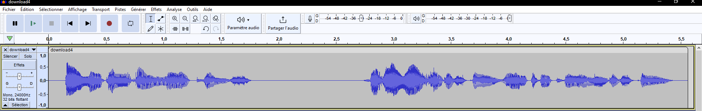

## Category

> Steganography

## Description

*by memory*
> retrouve le flag lol

## Files

[Silent_hill_2.png](Silent_hill_2.png)

- Author: **kuorashi**
---

## Write up

### Aperisolve

Putting the file on [Aperisolve](https://aperisolve.fr/5130b332fbdb2d7cf9e8d2333101932d) helps us find the entry point:


It really looks like there is som **LSB** hidden in **3 bits** in the two corners. We can suppose there is the same on the bottom left, but is not easily visible.

It appears for the three colors, so there might be **LSB 3-Bits RGB**

Looking even closer, let us find that:


There is also a LSB 3-bits RGB for this corner as well, but really smaller.

Let's cut our image in for equal images: 

```python
from PIL import Image
img = Image.open('Silent_hill_2.png')
w, h = img.size
img.crop((0, 0, w//2, h//2)).save('split1.png')
img.crop((0, h//2, w//2, h)).save('split2.png')
img.crop((w//2, 0, w, h//2)).save('split3.png')
img.crop((w//2, h//2, w, h)).save('split4.png')
```


### Stegonline

It's now time to recover data. I used [Stegonline](https://georgeom.net/StegOnline/upload), because of its flexibility in LSB : 


Using the **split3**, we can easily see the data sing the three least significant bits:

```
Speak. I am the Crimson One.

The lies and the mist are not they but I. You all know that I am one. Yes, and the One is I.

Believers hearken to me! Twenty score men and seven thousand beasts. Heed my words and speaketh them to all, that they shall ever be obeyed even under the light of the proud and merciless sun.

I shall bring down bitter vengeance upon thee and thou shalt suffer my eternal wrath.

The beauty of the withering flower and the last struggles of the dying man, they are my blessings.

Thou shalt ever call upon me and all that is me in the place that is silent.

Oh, proud fragrance of life which flies towards the heart. Oh Cup which brims with the whitest of wine, it is in thee that all begins.

MCTF{d1D_y
```

The next part is composed of **split2**, sing the same bits we recover some base64 data. [Cyberchef](https://gchq.github.io/CyberChef/#recipe=From_Base64('A-Za-z0-9%2B/%3D',true,false)&input=VkdobElHNWhiV1VnWTI5dFpYTWdabkp2YlNCMGFHVWdiR1ZuWlc1a0lHOW1JSFJvWlNCd1pXOXdiR1VnZDJodmMyVWdiR0Z1WkNCM1lYTWdjM1J2YkdWdUlHWnliMjBnZEdobGJTNEtWR2hsZVNCallXeHNaV1FnZEdocGN5QndiR0ZqWlNCVWFHVWdVR3hoWTJVZ2IyWWdkR2hsSUZOcGJHVnVkQ0JUY0dseWFYUnpMaUJDZVNCVGNHbHlhWFJ6TENCMGFHVjVJRzFsWVc1MElHNXZkQ0J2Ym14NUlIUm9aV2x5SUdSbFlXUWdjbVZzWVhScGRtVnpMQ0JpZFhRZ1lXeHpieUIwYUdVZ2MzQnBjbWwwY3lCMGFHRjBJSFJvWlhrZ1ltVnNhV1YyWldRZ2FXNW9ZV0pwZEdWa0lIUm9aU0IwYUhKbFpYTXNJSEp2WTJ0ekxDQmhibVFnZDJGMFpYSWdZWEp2ZFc1a0lIUm9aVzB1Q2tGalkyOXlaR2x1WnlCMGJ5QnNaV2RsYm1Rc0lIUm9hWE1nZDJGeklIZG9aWEpsSUhSb1pTQm9iMnhwWlhOMElHTmxjbVZ0YjI1cFpYTWdkRzl2YXlCd2JHRmpaUzRLUW5WMElHbDBJSGRoY3lCdWIzUWdkR2hsSUdGdVkyVnpkRzl5Y3lCdlppQjBhRzl6WlNCM2FHOGdibTkzSUd4cGRtVWdhVzRnZEdocGN5QjBiM2R1SUhSb1lYUWdabWx5YzNRZ2MzUnZiR1VnZEdobElHeGhibVFnWm5KdmJTQjBhR1Z6WlNCd1pXOXdiR1V1SUZSb1pYSmxJSGRsY21VZ2IzUm9aWEp6SUhkb2J5QmpZVzFsSUdKbFptOXlaUzRLU1c0Z2RHaHZjMlVnWkdGNWN5d2dkR2hwY3lCMGIzZHVJSGRsYm5RZ1lua2dZVzV2ZEdobGNpQnVZVzFsTGlCQ2RYUWdkR2hoZENCdVlXMWxJR2x6SUc1dmR5Qm9iM0JsYkdWemMyeDVJR3h2YzNRZ2FXNGdkR2hsSUhabGFXeHpJRzltSUhScGJXVXVDa0ZzYkNCM1pTQnJibTkzSUdseklIUm9ZWFFnZEdobGNtVWdkMkZ6SUdGdWIzUm9aWElnYm1GdFpTd2dZVzVrSUhSb1lYUWdabTl5SUhOdmJXVWdjbVZoYzI5dUlIUm9aU0IwYjNkdUlIZGhjeUJ2Ym1ObElHRmlZVzVrYjI1bFpDQmllU0JwZEhNZ2NtVnphV1JsYm5Sekxnb3dkVjlHYVc1RVh3PQ) helps s decode it:


``0u_FinD_``

The third part is made of **split4**, once again decoded from base64. But it is not plain text. The string is so big, it looks like a file. However, cyberchef is not able to detect of what kind.

Download it, and use the command ``file`` to know what it is :

```bash
$ file download.dat
download.dat: MPEG ADTS, layer III, v2,  48 kbps, 24 kHz, Monaural
```
**MPEG** file ambedded in a picture of a radio: **this is sound**



It says : ``All letter are lowercase : four l l underscore one t three m underscore`` : `4ll_1t3m_`

And the last consists of **split1**, which also embedd a big base64 string. [Cyberchef](https://gchq.github.io/CyberChef/#recipe=From_Base64('A-Za-z0-9%2B/%3D',true,false)Detect_File_Type(true,true,true,true,true,true,true)) helps us find the type of data this time: **MP4 video**




``h1d3_h3r3_?}``



- Corner top right: text -> ``MCTF{d1D_y`` 
- Corner bottom left: base64 -> text -> ``0u_FinD_``
- Corner bottom right: base64 -> MPEG file -> ``4ll_1t3m_``
- Corner top leftt: base64 -> MP4 file -> ``h1d3_h3r3_?}``




:triangular_flag_on_post: `MCTF{d1D_y0u_FinD_4ll_1t3m_h1d3_h3r3_?}`

