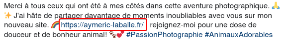
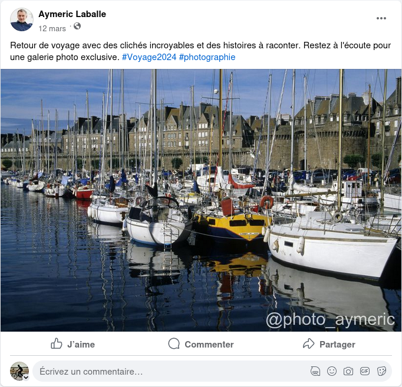
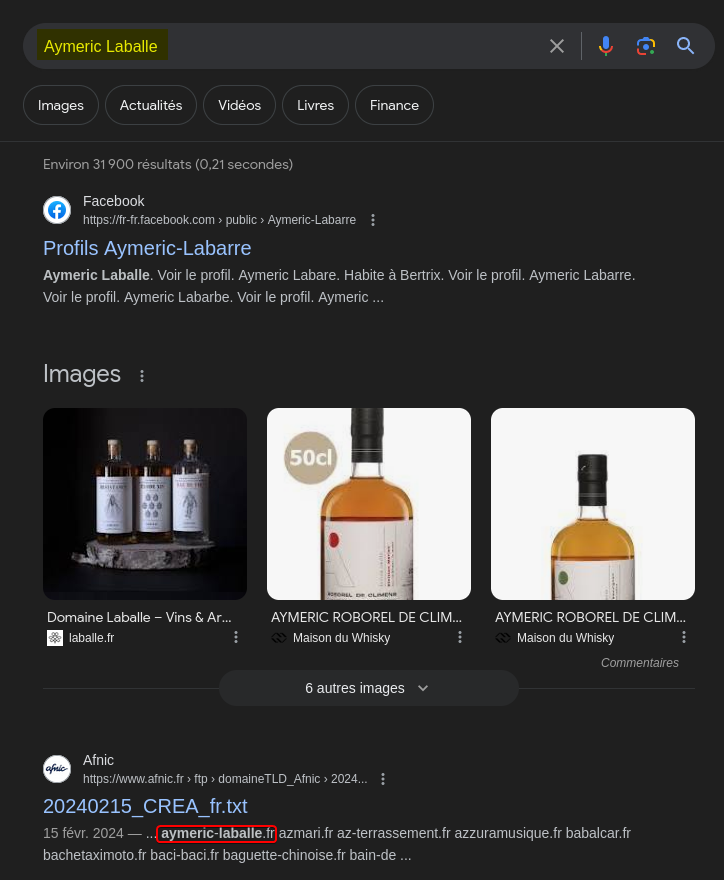
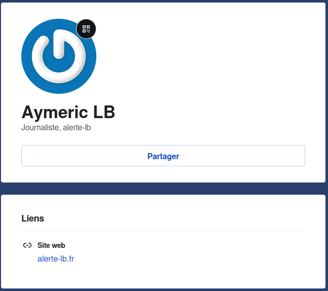
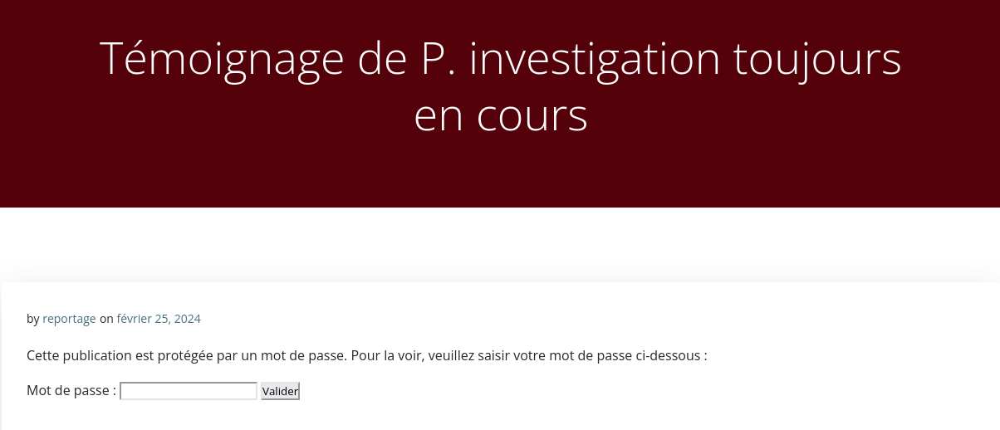
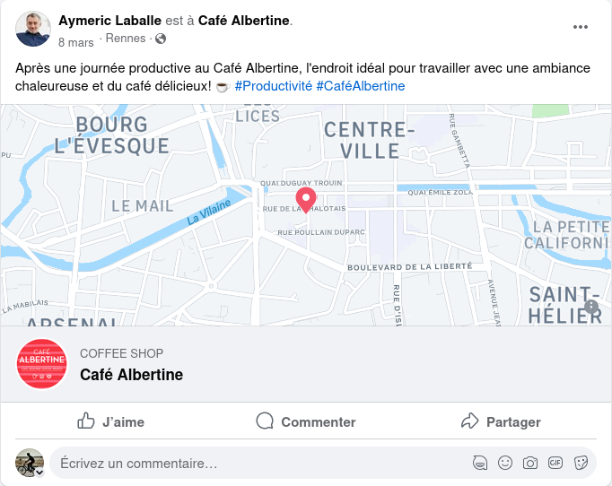
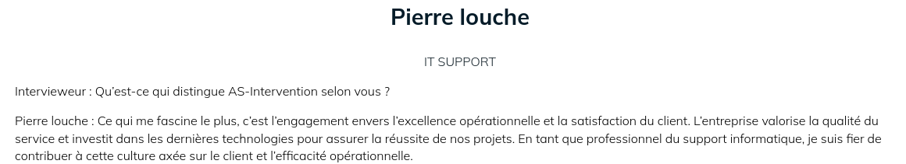
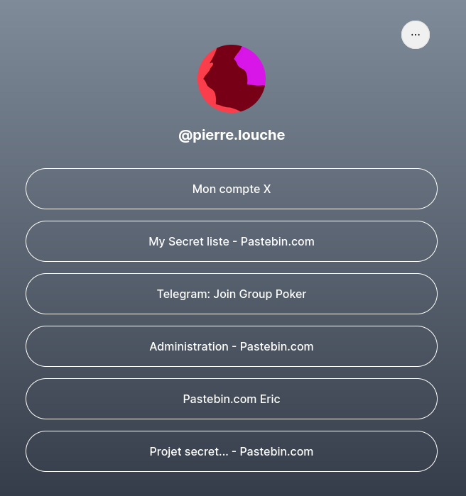
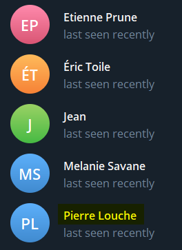

## Category

> OSINT

## Description

> Votre mission consiste à enquêter sur la personne apparaissant dans la dernière vidéo transmise par l'agence. Un de nos agents a pris des risques considérables pour obtenir son nom et prénom. Votre tâche est de découvrir l'identité de cette personne et de déterminer ce qui lui est arrivé.

## Files

[Ordre de mission](mission.pdf)

- Author: **Neyzor & Giorgone**
---

## Write up

### Notre cible

La video de départ est la suivante :



On y voit une personne ressemblant à un agent, et une personne kidnappée dans le coffre de sa voiture. **C'est notre cible**

On aperçoit à un moment donné un dossier marqué "CONFIDENTIEL" avec du texte marqué dessus :

C'est un peu flou, mais on arrive à distinguer le nom :
> **Aymeric LABALLE**

### Journaliste et Photographe

Avec son nom, nous pouvons le rechercher sur différents réseaux sociaux (facebook, linkedin, Twitter, Instagram, etc)

On trouve ce compte [Twitter](https://twitter.com/Laballe_Daily) :

Il y parle de journalisme, d'actualité, d'IA, de photographie animale. Il dit aussi avoir un **blog**



On peut alors tenter naivement de chercher le site https://aymeric-laballe.fr/

Et ça marche !

Il s'agit de son blog de photographie.



Il y avait évidemment une autre façon de faire prévue, et il s'agissait de passer par son instagram : 

Le compte Instagram étant trouvable grâce au Facebook. Ce dernier est trouvable en cherchant son nom :





Un autre façon était de chercher son nom sur Google :

Un dump de noms de domaines provenant de l'AFNIC (*Association française pour le nommage Internet en coopération*) cite le nom de domaine de notre cher aymeric.



Sur ses photos, il inscrit un @, très probablement un pseudo à lui :

Le pseudo est **@photo_aymeric**

Si l'on utilise un outil de recherche de pseudos comme [blackbird](https://blackbird-osint.herokuapp.com/#/results), on trouve qu'il a un compte [Instagram](https://www.instagram.com/photo_aymeric/) avec ce pseudo.



Il parle de technologie, mais surtout de photos et d'animaux.

En haut du profil, on peut ne rien trouver sur ordinateur. En revanche, sur téléphone, un bouton "**Adresse mail**" apparaît : `aymeric.laballe.prive@proton.me`

On est alors en mesure de faire une recherche via email grâce à un outil comme [Epieos](https://epieos.com/?q=aymeric.laballe.prive%40proton.me&t=email), et l'on trouve qu'il possède un compte.

En cherchant comment récupérer un compte gravatar avec un email, on trouve une [page dédiée](https://fr.gravatar.com/) sur le site officiel. On trouve alors son [compte](https://fr.gravatar.com/aymericlaballeprive) : 

Son profil référence un lien : https://alerte-lb.fr/

En regardant dessus, on voit qu'il s'agit de son fameux **blog de journalisme**. D'après son tweet, il y aurait des articles protégés. On va donc chercher à énumérer les différents posts existants, à l'url suivante : `https://alerte-lb.fr/wp-json/wp/v2/posts`

On trouve 5 articles :
- https://alerte-lb.fr/2024/02/25/revelation-choc-un-lanceur-dalerte-denonce-des-pratiques-troublantes-dans-lindustrie-agroalimentaire/
- https://alerte-lb.fr/2024/02/25/revelations-poignantes-un-lanceur-dalerte-denonce-le-scandaleux-traitement-des-animaux-dans-un-zoo-renomme/
- https://alerte-lb.fr/2024/02/25/scandale-financier-dans-le-monde-de-la-chirurgie-esthetique-un-lanceur-dalerte-revele-des-detournements-de-fonds-choquants/
- **https://alerte-lb.fr/2024/02/25/backup-n127/**
- https://alerte-lb.fr/2017/02/11/bonjour-tout-le-monde-2/

Les trois premiers et le dernier sont des articles révélateurs de son milieu : lanceur d'alerte, actualité polémique, scandales, etc.

En revanche le 4e à un nom, et un contenu intéressant :

Un article **protégé par mot de passe**, qui rapporte un certain **témoignage**...
On commence à avoir une piste concernant sa disparition : quelqu'un aurait pu vouloir le faire taire.



Notre ami possède un compte [Spotify](https://open.spotify.com/user/31qszakeln3aodi43pbepsxmo2gm), trouvable depuis son Facebook.

Mais ce dernier ne nous a pas été utile. Il donne plus de réalisme au personnage.



### Le farfouilleur

Pour trouver son code, les agents en lien avec nous dans l'agence nous ont apporté une information importante :

> Aymeric n'utilise que son pavé numérique pour ses codes

Plusieurs possibilités s'offrent à nous :
- le code pourrait avoir fuité
- le code proviendrait d'une valeur qui lui tient à cœur (eg. date).
- le site web protège mal son code

Il se trouve qu'à cette étape, nous avions déjà trouvé et compris ce que nous voulions.



Dans ce post instagram, il parle fièrement de son chien. Il écrit un commentaire beaucoup plus long que ses autres posts. Et parmi ce texte, il parle d'une **date d'adoption** Le **15/02/2020**. Cela pourrait correspondre à notre deuxième solution.


Le code est **15022020**


Cela nous donne accès à de nombreux screenshots d'emails et de photos de conversations SMS : 

Toutes les photos sont 

Dans ces photos, on apprend qu'il a été contacté par un Pierre, qui possède des documents compromettants sur son entreprise, et compte sur Aymeric pour l'aider à investiguer et dévoiler tout cela au grand jour.

Pierre lui fournit des preuves photos, et après avoir refusé de prendre rendez-vous physiquement avec Aymeric, ils ont probablement fini par se rencontrer au **café albertine**

Un post d'Aymeric nous indique où se trouve ce fameux café : 

Les photos montrant des factures donnent accès à un email et au site de l'entreprise en question, pointée du doigt par Pierre.

### Intervention, investigation

L'entreprise est **AS-Intervention**, leur site est https://as-intervention.fr/

Leur site met en avant leur domaine d'activité :
>Nous offrons une gamme complète de services dans le domaine de la conception et de la fabrication de missiles, ainsi que des solutions d'approvisionnement en bateau et en avion à l'échelle mondiale.

Ils travaillent dans **l'armement militaire.**

On trouve aussi des citations d'employés :

Sur la page [à propos](https://as-intervention.fr/a-propos/) on trouve l'interview de **Pierre Louche**, du Support IT

Il s'agit donc du Pierre qui a échangé avec Aymeric.


L'entreprise **AS-Intervention** faite du business d'armement à très haute valeur, et semble vouloir garder cela secret et protégé.
**Pierre Louche** du support IT s'en rend compte, collecte des preuves, et contacte le journaliste **Aymeric Laballe** pour que ce dernier fasse paraître cela au grand jour.


### Toujours plus Louche

Essayons d'en apprendre plus sur Pierre. Il aura probablement plus d'informations concernant la disparition d'Aymeric.

Comme notre cher Aymeric, Pierre possède un [compte Twitter](https://twitter.com/_pierrelouche)

Pour autant, aucun poste à ce jour, aucun follow ou liste intéressante.
La recherche par pivot avec l'username (@_pierrelouche) ne donne rien non plus.

Bizarre d'avoir un twitter aussi vide... Peut-être qu'il était plus intéressant avant ? En cherchant sut https://archive.org, on trouve une [archive de son compte](https://web.archive.org/web/20240214185923/https://twitter.com/_pierrelouche) :

On trouve alors le lien de son [linktree](https://linktr.ee/pierre.louche)

De nombreux liens sont alors à notre disposition : 

- [Mon compte X](https://twitter.com/_pierrelouche) : son Twitter
- [My Secret liste - Pastebin.com](https://pastebin.com/AufN6aM8) : un pastebin avec une liste d'animes
- [Telegram: Join Group Poker](https://t.me/+dGupLEDgAnM1NWRk) : Lien Telegram vers une conversation sans historique autour du Poker
- [Administration - Pastebin.com](https://pastebin.com/BVQbkxdA) : Lien pastebin avec un script powershell pour de l'AdminSys
- [Pastebin.com Eric](https://pastebin.com/7CVviAth) : Lien pastebin qui donne vers un lien [Groupe Telegram Boulot](https://t.me/+nGnMfes8XHhiNTU8)
- [Projet secret.. – Pastebin.com](https://pastebin.com/Miz64hWX) : Lien pastebin avec un programme sportif

Si l'on regarde les personnes présntes dans le Telegram Poker, on y trouve des noms : 

Pour l'insant aucune assurance qui sont ces personnes, cela peut être d'autres enquêteurs ou vraiment des proches de Pierre.

Le Telegram Boulot est en revanche bien plus intéressant :


On commence par discerner les noms de ces collègues impliqués :
- Etienne Prune
- Eric Toile
- Pascal (?) : "grand patron"

Chacun raconte un peu sa vie, jusqu'au moment où Pierre se voit demander un service particulier à son travail :

>  J'ai reçu un message du chef aujourd'hui, je ne vous raconte pas, il avait l'air sérieux..
> il m'a donné une tache de manière particulière

Cette tâche concerne un certain "Pascal" le "Grand patron". Le service est demandé très discrètement, à une personne de confiance. Ce n'est donc pas quelque chose qui se veut être entendu. 

Soit c'est intime, soit c'est confidentiel, soit c'est tout bonnement illégal. Au vu des photos, cela confirme la théorie du **business illegal**.

Pierre veut en parler à ses collègues après avoir vu les onglets actifs, les factures et les messages.

L'employé est surpris en train de prendre les photos par **une personne inconnue**, avec un air agressif. Pierre a peur et craint de se faire virer suite à cela.

Le lendemain, il a eu le temps d'envoyer les documents à Aymeric, avant de ne **plus donner une seule nouvelle**.

### Théorie finale

C'est ici que se termine cette enquête, pour le moment. Nous avons suffisamment d'éléments pour établir une théorie sur les événements à l'heure actuelle.


L'entreprise **AS-Intervention** fait du business illégal de matériel militaire. Les factures ne sont pas recevables, et les valeurs d'argent sont très élevées.

**Pierre Louche**, du Support IT de cette entreprise, est demandé pour un service par Pascal, le grand patron. Ce service se doit être très discret, et dans la confidence. C'est à ce moment, en faisant son travail sur l'ordinateur de Pascal, que **Pierre tombe sur ces preuves**. Il les prend en photo, mais **se fait surprendre par un inconnu**. La personne a l'air agressif, jamais vu dans la boite, qui l'a bien vu prendre des photos.  

Entre temps, Pierre a pris contact avec **Aymeric Laballe**, un journaliste lanceur d'alerte. Ils se sont mis d'accord pour enquêter sur cette affaire, et Pierre lui a envoyé les preuves.

Le dernier signe de vie de Pierre sur internet remonte au **3 avril**, après quoi plus de nouvelles. Dans son dernier mail à Aymeric, il dit avoir revu une personne, et que ça l'inquiète. Il s'agit probablement de **l'inconnu agressif**, en route pour kidnapper Pierre, afin de le faire taire.

La même chose est ensuite arrivée à Aymeric, qui se retrouve enlevé dans le coffre d'une voiture, afin que son article ne soit jamais publié.


