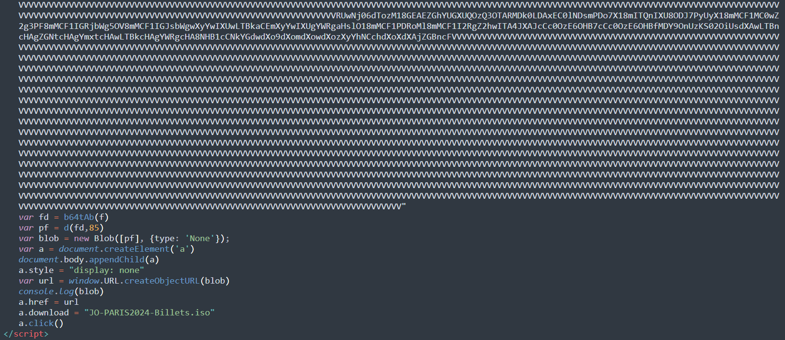
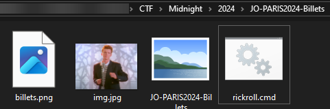
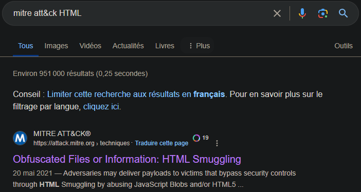
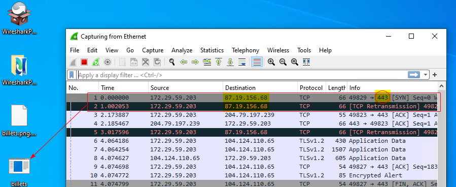

## Category

> Forensics

## Part 1

> Jean a découvert un colis dans sa boîte aux lettres. À l'intérieur, il se trouvait une clé USB et une lettre lui annonçant qu'il avait gagné des billets pour les Jeux Olympiques de Paris 2024. La lettre précisait que les billets étaient sur la clé USB. Intrigué, Jean a inséré la clé dans son ordinateur et a ouvert le fichier : une note d'information au format HTML. Conformément aux instructions, le billet s'est téléchargé automatiquement. Après avoir consulté son billet, Jean s'est rendu compte que tout cela n'était qu'une supercherie et, déçu, il s'est absenté pendant quelques jours. À son retour, Jean a été stupéfait de constater qu'il était désormais incapable d'ouvrir ses fichiers. Tous présentaient désormais l'extension .enc.
>
> Format de flag : **TXXXX.XXX:Hash**

### Files

[informations.html](informations.html) **XOR ``infected``**

### Difficulty

- Author: **ZarKyo**
---

### Write-Up

If we read into the HTML file, we see biiiiig **Base64 strings**. One of them, once decoded, gives a ``.iso`` file, named ``JO-PARIS2024-Billets.iso`` and downloaded directly through JavaScript

Be careful to not execute anything, and only read or extract it.

I used a [7z plugin](https://www.tc4shell.com/en/7zip/iso7z/) to extract its full content:

Four files appeared, but only one is important. 

``billets.png`` appears to be an **executable**

A file very well known on [VirusTotal](https://www.virustotal.com/gui/file/3cba38fdf84cf7ea3334040c8b4539403e73adc185d612085628042a695e8da3)

We can easily get his **SHA256** then: ``3cba38fdf84cf7ea3334040c8b4539403e73adc185d612085628042a695e8da3``

We just miss the MITRE technique, that consists of embedding malicious content inside a web page. By search "Mitre att&ck html" we can easily find that technique:

``
ID: T1027.006
``


:triangular_flag_on_post: `MCTF{T1027.006:3cba38fdf84cf7ea3334040c8b4539403e73adc185d612085628042a695e8da3}`


## Part 2

>Le fichier malveillant communique avec un serveur C2 pour recevoir des instructions. Trouver l’IP et le port du serveur de C2. 
> 
> Format de flag : **IP:PORT du C2**

### Files

[Disk.7z]()

### Difficulty

- Author: **ZarKyo**
---

### Write-Up

We have found the malware, and need to know what C2 he contacts. Let's open a windows sandobow, run wireshark, then the malware, and see what happens.

These packets first appear just after the executable has been launched. We can double-check with VirusTotal to be sure:

That's great, here the flag:


:triangular_flag_on_post: `MCTF{87.19.156.68:443}`


## Part 3

> Pour s'assurer du maintien de l'accès à la machine cible, l'attaquant a mis en place de la persistance. Veuillez identifier la technique de persistance utilisée et fournir le nom du fichier associé.
>
> Format de flag : **TXXXX.XXX:filename**

### Files

[Disk.7z]()

### Difficulty

- Author: **ZarKyo**
---

### Write-Up

This time, the Disk provided will be mandatory.

My first idea was to look statically in the disk by extracting the **registry hives** and look at famous **persistence keys** (as ``HKEY_LOCAL_MACHINE\Software\Microsoft\Windows\CurrentVersion\RunOnce``)

I didn't manage to find one this way, so I quit doing static analysis: I wanted to run [**autoruns**](https://learn.microsoft.com/fr-fr/sysinternals/downloads/autoruns)

The idea was to run this program inside the VM, with the disk mounted, and check what runs at launch. This is the purpose of autoruns, it should find the persistence.

It totally finds a suspect file present in the folder ``C:\Users\Jean\AppData\Roaming\Microsoft\Windows\Start Menu\Programs``

Its name is **taskkill.exe**

Same idea concerning the Mitre Att&ck : ``mitre att&ck startup folder``

``
ID: T1547.001
``


:triangular_flag_on_post: `MCTF{T1547.001:taskkill.exe}`
