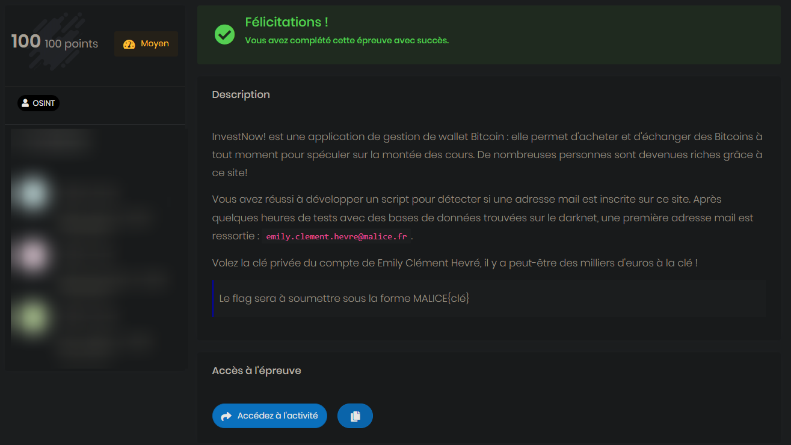

# Invest Now !

## Category

> OSINT

## Description

> InvestNow! est une application de gestion de wallet Bitcoin : elle permet d'acheter et d'échanger des Bitcoins à tout moment pour spéculer sur la montée des cours. De nombreuses personnes sont devenues riches grâce à ce site!
>
>Vous avez réussi à développer un script pour détecter si une adresse mail est inscrite sur ce site. Après quelques heures de tests avec des bases de données trouvées sur le darknet, une première adresse mail est ressortie : ``emily.clement.hevre@malice.fr``.
>
>Volez la clé privée du compte de Emily Clément Hevré, il y a peut-être des milliers d'euros à la clé !
>
>Le flag sera à soumettre sous la forme MALICE{clé}

## Link

[Invest Now](http://investnow2.chall.malicecyber.com/)

## Difficulty

**MEDIUM** - 100 points

- Author: **Sysdream**
---

## Write up

### Knowing Emily

I first tried to look for accounts owned by this person, before knowing what to find inside.

The name is pretty unusual, like most of the fictional characters, it was quite easy to find her accounts.

Beginning with [Facebook](https://www.facebook.com/emily.clementhevre), typing her full name gives only one resulting account:



Here we can find that information:
- Her living city: **Montpellier**
- Her past high school: **Lycée Antoine BOURDELLE**
- Her workplace : **Restaurant La ferme du nouveau monde**
- She seems to like **Marseille** and its football team, **OM**

We keep that in mind, and go look for another account

Her [Instagram](https://www.instagram.com/emilyclementhevre/) could be found using the same method, searching for her full name in the social media:



Here we can find the following information:
- She likes **goats**
- Her face

Nothing more useful at first sight. What if she had a Twitter account?

Her [Twitter](https://twitter.com/emily_clement_h) account could also be found with her full name:



Once again, we could find that information:
- She loves **Paris** too
- She loves musicians **Katty Perry**, **P!nk** and **Parov Stelar**
- She shared lyrics from the album **The Princess** of **Parov Stelar**

I was not able to find more account or information, and I don't think there was more. 

### What is the name of your dog?

I spent much more time finding the [link](#link) given in the challenge...

than all the information about emily (╯°□°)╯︵ ┻━┻


Take great care to read the description and the assets!


We had access to the famous website her email was leak from:



Going into **Login** > **I lost my password !**, we could enter her email to maybe find a way to recover her account.

What an interesting option we have here...

We were asked three personal questions about her, to potentially get access to her account:



The account we found will help us answer those questions.

Now, we need to write down all we know about those questions:

| Song         | City        | Animal |
|--------------|-------------|--------|
| The Princess | Montpellier | Goat   |
|              | Marseille   | Horse  |
|              |             |        |

This is what I had at first sight. however, some more researches were needed to eliminate false positive, and precise some information:
1. Her high school could probably be located in her birthplace, which is **[Montauban](https://fr.wikipedia.org/wiki/Lyc%C3%A9e_Antoine-Bourdelle)**
2. The image of the song she shares on twitter refers to an album. We need to look for the lyrics to find the correct song: **[All Night](https://mojim.com/usy135747x2x15.htm)**

We can now correct our table:

| Song      | City        | Animal |
|-----------|-------------|--------|
| All Night | Montpellier | Goat   |
|           | Marseille   | Horse  |
|           | Montauban   |        |

The right combination was:
1. **All Night**
2. **Montauban**
3. **Goat**

Which recovers well the account:




:triangular_flag_on_post: `MALICE{5JWVBcrWBS2F98nRai8BjDKt8EBQ8Jm9CtMEQD1xkpGNwqFFGgX}`


