# SOC Simulator


## Category

> Forensics

## Description

> Introduction commune à la série SOC Simulator
>
>Durant l'été 2022, un opérateur d'importance vitale (OIV) alerte l'ANSSI car il pense être victime d'une cyberattaque d'ampleur. Le security operation center (SOC) de l'OIV envoie à l'ANSSI un export de sa collecte système des derniers jours. Vous êtes chargé de comprendre les actions réalisées par l'attaquant.
>
> Note : Les 5 parties sont numérotées dans l'ordre chronologique de l'attaque mais il n'est pas nécessaire de les résoudre dans l'ordre.

- Author: **FCSC**

## Files

[soc_event.zip](https://files.france-cybersecurity-challenge.fr/dl/soc-simulator/soc_events.zip?token=eyJ1c2VyX2lkIjo1MjAsInRlYW1faWQiOm51bGwsImZpbGVfaWQiOjEzOH0.ZhfnJw.cFSVmuSdSfzdoEcHjM5NsDKakVI)

## Write-Up

We are given ***7GB*** of WIndows Event Logs in `.evtx` format. The usual format is separating files in types of inputs, like this :

- PowerShell-Operationnal.evtx
- Security.evtx
- ...

This time, the logs provided are like this : 


I was not going to open the files one by one, and even less in the :sparkles: ***beautiful*** :sparkles: Windows Event Log viewer.

I wanted to use a tool made to convert `evtx` to CSV, called [EvtxECmd](https://github.com/EricZimmerman/evtx).
However, this was the first time that itdid not success to parse the files. This is not a troubleshooting write-up: **I found a better way**.

Another tool made to analyse event logs, but which imports sigma rules : [Hayabusa](https://github.com/Yamato-Security/hayabusa)

It is gonna parse the files like the previous tool, and output a CSV timeline file. The rules will helped me SO MUCH resolving these challenges.

I used this commandline :   
```powershell  
.\hayabusa-2.14.0-win-x64.exe csv-timeline -d ..\CTF\fcsc\soc_events -o ..\CTF\fcsc\soc.csv
```

We now have two files :
- one with the "Core" rules of Hayabusa: only **High** and **Critical** rules
- another one with **all rluset** (info, low, med, high, crit)

Let's analyze!

## 1/5 : Inital Vector

### Description

>Retrouver le nom de la vulnérabilité et l'heure UTC de la première tentative d'exploitation de cette vulnérabilité.
>
>Format du flag (insensible à la casse) : `FCSC{EternalBlue|2021-11-27T17:38}`

**:star: :star:**

### Screenshot


### Write-Up

We are looking to the vulnerability exploited to pwn one of the computers/servers.

I opened my first CSV using [TimelineExplorer](https://www.sans.org/tools/timeline-explorer/), a tool design to be used on Windows, for reading CSV as DFIR timeline.

We can group the columns by `Computer` and `Rule Title` to easily view which rules have ringed on which computers :

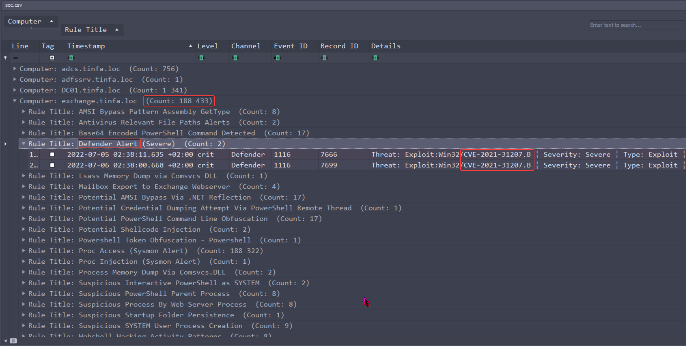

We can easily see that the computer with the most security events triggered is `exchange.tinfa.loc`.

Even more, Defender alerts have been trigerres as exploits of the `CVE-2021-31207.B`.

By looking on the internet, we can found [this page](https://news.sophos.com/en-us/2021/08/23/proxyshell-vulnerabilities-in-microsoft-exchange-what-to-do/) for example, among many others.

It talks about a **Remote Code Execution** for this peculiar CVE. Those vulnerabilites in Microsoft Exchange are called **ProxyShell**

We probably have the entrypoint. Lets check that.

By loing further, we find that this is an exploit in the proxy of Exchange, and the path containing `\HttpProxy\owa\auth\<file>.aspx`. This exploits an aspx file for this RCE

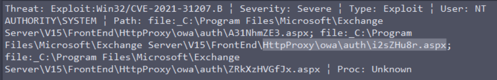

It looks like this is the right vulnerability !

We still need to order our events in ascending timestamp, and take the first exploit attempt about the exchange server : 

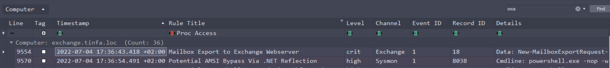

Here it is, an attempt to **Exporting a Mailbox** at **2022-07-04 17:36:43 +02:00**


:triangular_flag_on_post: `FCSC{ProxyShell|2022-07-04T15:36:43}`


## 2/5 : Secrets stealed 1

### Description

>Après l'action vue dans la partie 1, l'attaquant vole les identifiants système en mémoire. Retrouver le GUID du processus effectuant ce vol et le nom du fichier où il écrit les secrets volés.
>
>Format du flag (insensible à la casse) : `FCSC{6ccf8905-a033-4edc-8ed7-0a4b0a411e15|C:\Windows\Users\toto\Desktop\fichier.pdf}`

**:star:**

### Screenshot

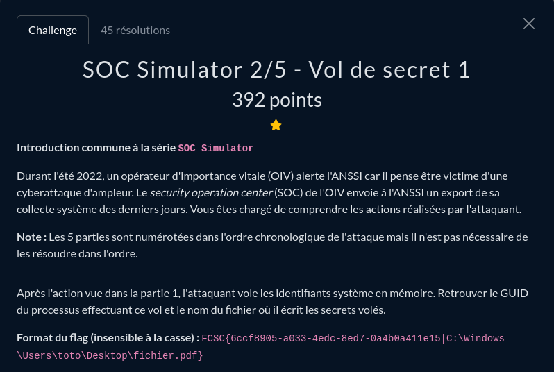

### Write-Up

According to the description, he stole "system credentials stored in memory".

If you already know Windows systems and usual attacks, or by looking where are stored the system credentials in memory, you'll know what process has been dumped : **LSASS**

The **Local Security Authority Subsystem** is the process that handles user and system authentication. Because it is stored in memory, crendentials are stored in *plain text*. It is a very popular way for attackers to stuff themselves with credentials, when you have enough permissions to dump this process.

According to the last logs, the attacker has the `EXCHANGE$` rights, wich means the local machine account, an admin account. He could easily dump this process.

Once again, sigma rules helped me a lot finding the right event :

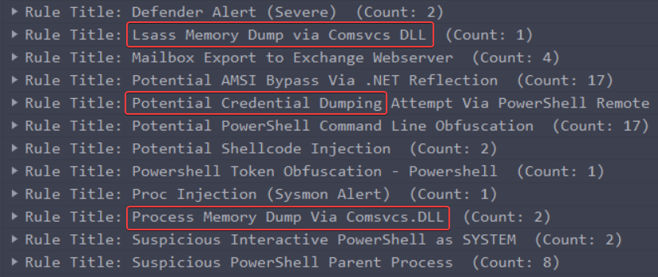

Those rules have been triggered.

Let's take a look to the last one :

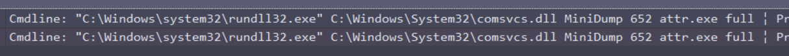

We found a peculiar cmdline.

```cmd
"C:\Windows\system32\rundll32.exe" C:\Windows\System32\comsvcs.dll MiniDump 652 attr.exe full
```

At first, it didin't triggered anything to me, because of the `.exe` extension. I was looking for a text file or something. I lost a lot of time looking at all the **obfuscated PowerShell execution** and **shellcode injection**. But if we think about it, dumping a process to a `.exe` makes sense. A process in memory is still a process, an executable.

Moreover, if I just took time earlier to search for this dump technic, "Memory Dump Via Comsvcs.DLL"

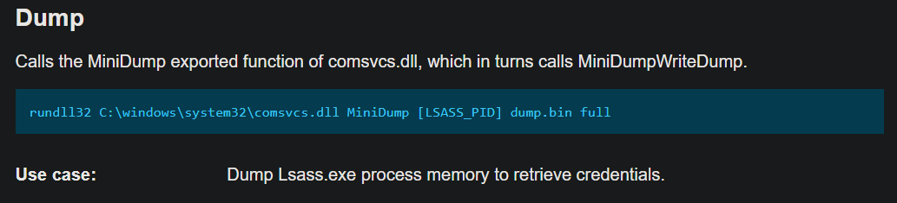

The command-line is exactly the same. **He just dump LSASS using `comsvcs.dll`, into `attr.exe`**


We can open the cell content to get more details : 


> b99a131f-0d4b-62c3-ce03-00000000db01




This CSV does not contain the full path of attr.exe, because I only chose to eport the high and critical rules in Hayabusa.

I had to open the second CSV, with all information, to look for our file creation.

Then search "`attr.exe`" and "File created" :


> C:\Windows\System32\inetsrv\attr.exe




:triangular_flag_on_post: `FCSC{b99a131f-0d4b-62c3-ce03-00000000db01|C:\Windows\System32\inetsrv\attr.exe}`


## 3/5 : Exfiltration

### Description

>Dans la continuité de ce qui été vu précédemment, l'attaquant a collecté une quantité importante de données métier. Retrouver la commande qui a permis de collecter tous ces éléments.
>
>Format du flag : `FCSC{sha256(<commande en UTF8 sans saut de ligne>)}`
>
>Par exemple, si la commande malveillante était `7z a "Fichiers volés.zip" C:\Windows\System32`, le flag serait `FCSC{bc5640e69c335a8dbe369db382666070e05198a6c18ce88498563d2c4ac187b1}`.

**:star: :star:**

### Screenshot

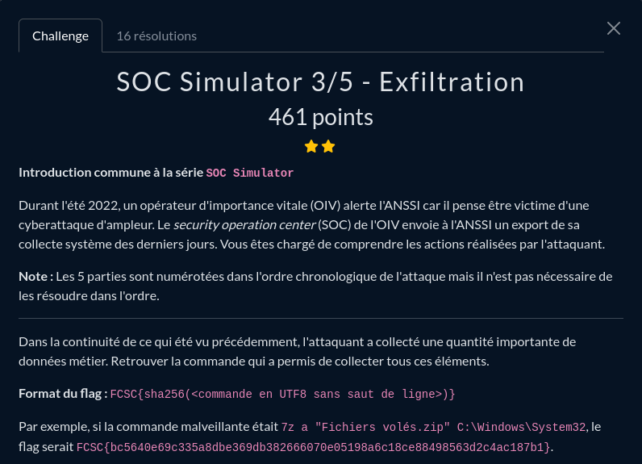

### Write-Up

After dumping the LSASS process, a data exfiltration has been done by the attacker.

This one is probably the most hidden one. I first looked at the high and criticals rules. There were the LSASS dump, and couples of encoded + obfuscated PowerShell script executed, that were injection shellcodes in memory. That was only wrong tracks for this part.

Then I look at all the `Cmdline` found in all rules-set. That were a LOT. And nothing really interesting excepting what we already knew, and shitty Windows stuff.

After few days, I tried to replace myslef inside the context :
- Data exfiltration
- Inside an Exchange server

.......what if he exported... mails ?

I used this filter to find this kind of events, among all events:

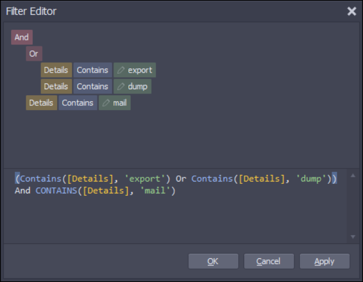




Looks like we found something really interesting


This **ScriptBlock** (Notice not a Cmdline) exports all Mailbox contained in the Exchange server. We got our exfiltration. Just need to SHA256 the whole line.


Here is the whole malicious command:

```powershell
foreach ($Mailbox in (Get-Mailbox -ResultSize Unlimited)) {New-MailboxExportRequest -Mailbox $Mailbox.DisplayName -FilePath "C:\windows\system32\xwin\($Mailbox.Alias).pst"}
```


:triangular_flag_on_post: `FCSC{2ee0ab1d44c759b09159ef21900c9826239a7b63e25c0e5935f200d30348b588}`


## 4/5 : Lateralisation

### Description

>Sur une courte période de temps, l'attaquant a essayé de se connecter à de nombreuses machines, comme s'il essayait de réutiliser les secrets volés dans la partie 2. Cela lui a permis de se connecter à la machine Workstation2. Retrouver l'IP source, le compte utilisé et l'heure UTC de cette connexion.
>
>Format du flag (insensible à la casse) : `FCSC{192.168.42.27|MYCORP\Technician|2021-11-27T17:38:54}`.

**:star:**

### Screenshot


### Write-Up

The attacker has finished his stuff on the exchange server, and now wants to move to another device.

According to the statement, he has moved to `Workstation2` from `Exchange` by doing **password spraying**: testing previously gathered password on multiples accounts/devices, hoping one has been re-used solewhere else.

My way of doing this was to filter by windows event ID. Each king of windows events has its own ID, and the ones we are looking for here are :

- `4624` : successful logon
- `4625` : logon failure

These events will show each successful or failed connection to an account, and its details.

Again, according to the statement, he tried credentials on multiples devices before achieving it, in a small timeframe: **we're going to look for a series of failure separated by a really time period.**

The filter has to be : **event ID : `4625`**


After scrolling lots of `User Does Not Exist`, we can found a series of `Wrong Password`, in a small timeframe, and on every computers in the capture.

It seems that we have found our password spraying. Now we have to find the successful logon just after the last fails. We keep the timeframe, and add the events `4624` to our filter :


It looks like we've found our lateralisation!

Let's see the details:


So we got:
- The source IP: **172.16.20.20**
- The account used: **Administrator**
- The UTC timestamp: **2022-07-06T13:26:57**

The only thing missing is the domain of the account. At first I thought about **TINFA\\** domain, which is the domain used by the accounts here. However this does not work. So the other possibility is that Administrator is a __local account__, with its own domain. By default it is **WORKGROUP**, but let's search before guessing.

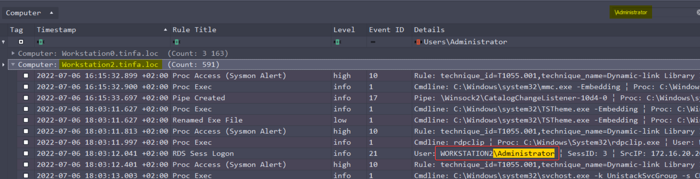

I search for **\\Administrator** occurrences on the Workstation2, and found it :

- User : **WORKSTATION2\\Administrator**


:triangular_flag_on_post: `FCSC{172.16.20.20|WORKSTATION2\Administrator|2022-07-06T13:26:57}`


## 5/5 : Secrets Stealed 2

### Description

>Sur la machine identifiée en partie 4, l'attaquant vole de nouveau les secrets du système. Retrouver le GUID du processus effectuant ce vol et le nom du fichier où il écrit les secrets volés.
>
>Format du flag (insensible à la casse) : `FCSC{6ccf8905-a033-4edc-8ed7-0a4b0a411e15|C:\Windows\Users\toto\Desktop\fichier.pdf}`.

**:star::star:**

### Screenshot


### Write-Up

The guy moved on `Workstation2`, and stole AGAIN system's secrets ? How greedy he is 🙄

Once again, sigma rules helped me a lot :wink:

We are located after the lateralisation, so after 2022-07-06 15:26:57 +0200. If we go back to our High and Critical rules set, we can find those rules on `Workstation2`:


We probably found the LSASS dump that we wanted !

But if we look closer, we see that it opens the file in **Internet Explorer**, to view the file. The dump is previous to that. Let's just re-open the file with all ruleset, and lookup for "**lsass.DMP**":

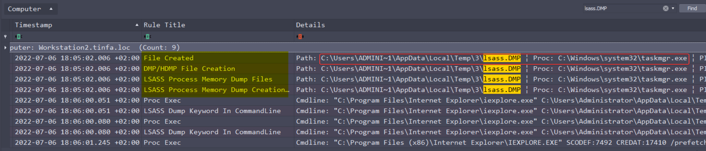

What we found here is that the attacker dumped the LSASS memory through taskmgr.exe, the **task manager**! He just dumped the memory of the process, and stored it in `C:\Users\ADMINI~1\AppData\Local\Temp\3\lsass.DMP`

Here are the details of the process:


Our information are:
- GUID of the process stealing the memory: `b7e8a6b7-b273-62c5-bc11-00000000d301`
- File path of the stealed secrets: `C:\Users\ADMINI~1\AppData\Local\Temp\3\lsass.DMP`


:triangular_flag_on_post: `FCSC{b7e8a6b7-b273-62c5-bc11-00000000d301|C:\Users\ADMINI~1\AppData\Local\Temp\3\lsass.DMP}`

